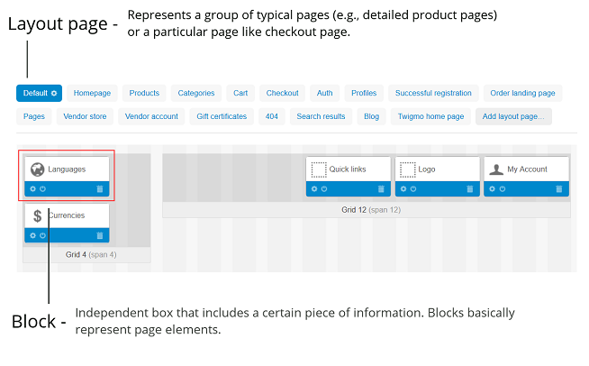

*******
Layouts
*******

Layouts determine the structure of your storefront. A layout consists of :doc:`layout pages <layout_pages/index>`, which represent various page types of your storefront.

===============
In this section
===============

.. toctree::
    :maxdepth: 1
    :titlesonly:
    :glob:

    */index

.. toctree::
    :maxdepth: 1
    :hidden:

    layout_structure

================
Managing Layouts
================

You can manage layouts in the **Design → Layouts** section of your store's administration panel.

.. hint::

    Click the **NEED HELP** on the **Design → Layouts** page to see the videos about layouts and the widget mode. 

.. image:: img/layout_management.png
    :align: center
    :alt: Layout pages have gear buttons next to their names.

Add new layouts by using the **+** button. The list of existing layouts appears on the right, in the **Switch layout** section. Click on layout names to switch between them. When you hover over a layout's name, you see a gear button, which offers the following actions:

* **Preview**—open the storefront with this layout in a separate page.

* **Make default**—make this layout default for the theme.

* **Properties**—configure this layout.

* **Delete**—delete a layout. 

  .. important::

      You cannot delete the default layout. Make another layout default first.

-----------------
Layout Properties
-----------------

When editing or adding a layout, you can define the following properties:

* **Name**—the name of the layout.

* **Copy data from layout** (when adding new layout)—choose the layout from which you want to copy the content.

* **Default**—this checkbox is ticked, the layout will be set as default.

* **Grid columns**—choose whether to use the 12- or 16-column grid in the layout.

* **Layout width**—choose how the pages layout will be formed: 

  * *Fixed width*—pages will have a fixed width (for example, 1200px); 

  * *Full width*—pages will have the full-width layout; 

  * *Fluid*—pages will have the responsive layout.

================
Layout Structure
================

Layout pages (and therefore, storefront pages) consist of :doc:`blocks <blocks/index>` nested inside containers.

A block contains a certain piece of information like a logo, product details, breadcrumbs, search form, navigation menu, etc. You can add, edit, remove, or simply move blocks to change the structure of the page. The following sketch presents the storefront structure and illustrates how a page may be composed.

.. image:: img/layout_01.png
    :align: center
    :alt: Storefront

.. image:: img/layout_03.png
    :align: center
    :alt: Containers
