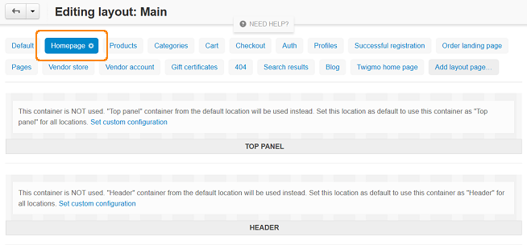

***********************
Actions on Layout Pages
***********************

Layout pages are not hard-coded or anyhow limited. You can have as many layout pages as you need. However, the default set of layout pages is generally enough.

When you need to perform an action on layout pages, go to the **Design → Layouts** section of your Administration panel.

General actions
***************

Adding a layout page
--------------------

To add a layout page:

*	In the list of layout pages, choose the **Add layout page** tab.

.. image:: img/layout_page_01.png
    :align: center
    :alt: Add layout page

*	A popup window with layout page properties opens. Specify the new `layout page properties <http://docs.cs-cart.com/4.3.x/user_guide/look_and_feel/layouts/layout_pages/layout_page_attributes.html>`_ and click the **Create** button.

Removing a layout page
----------------------

To remove a layout page:

*	Select a layout page and click the gear icon on the tab.

*	In the opened pop-up window click the trash can button.

.. image:: img/layout_page_03.png
    :align: center
    :alt: Remove layout page

*	Click **Ok**. This irrevocably removes the layout page.

Editing layout page properties
------------------------------

To change a layout page properties, select the layout page and click the gear icon on the tab. A special form with the layout page attributes opens. Edit the `layout page properties <http://docs.cs-cart.com/4.3.x/user_guide/look_and_feel/layouts/layout_pages/layout_page_attributes.html>`_ and click **Save** to apply changes.

Exporting/importing layout pages
********************************

Storefront layout pages can be imported and exported in an XML file. This feature becomes useful when you need to clone the layout among several storefronts. It is also recommended that you export layout pages before making any changes to the storefront layout. In case of emergency, you will be able to restore the original layout by importing the layout pages.

Exporting 
---------

To export layout pages:

*	Click the gear button in the upper right part of the page and choose **Export Layout**. This opens the export settings form.
*	Select the layout pages to be exported.
*	Choose the other export settings:

	*	**Output** - Output type: *Direct download* - export file will be downloaded to you computer; *Server* - file will be saved on the server where CS-Cart is installed; *Screen* - file contents will be displayed on the screen.
	*	**File name** - Name of the export file. By default, it is *layouts_<TIMESTAMP>.xml*.

*	Click **Export**.

Importing
---------

To import layout pages:

*	Click the gear button in the upper right part of the page and choose **Import Layout**. This opens the form for selecting the import file.
*	Choose the import file or enter the file URL.
*	Choose whether to create new layout or update current one.
*	If you have chosen to update current layout, specify the other export settings:

	*	**Clean up layout pages before import** - If selected, all original layout pages will be deleted before the import operation.
	*	**Override layout pages by dispatch** -  If selected, original layout pages will be replaced with the layout pages in the export file during an import operation. Otherwise, layout pages will be added to the original layout pages upon an import operation.

*	Click **Import**.