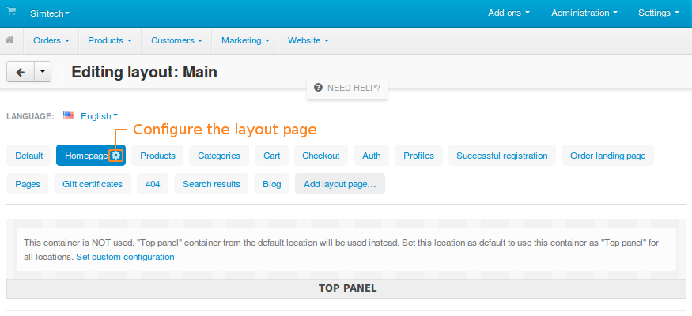

************
Layout Pages
************

:doc:`Layouts <../index>` consist of layout pages. A **layout page** represents either a certain type of storefront pages (for example, detailed product pages, category pages, etc.), or a specific storefront page (for example, checkout page, cart page, etc.)

.. note::

    To associate a layout page with a specific storefront page or page type, click the gear button next to the layout page name and change the value of the **Dispatch** field.

By editing the layout page associated with a specific type of storefront pages, you automatically change all storefront pages of that type. For example, if you change the **Products** layout page, all product pages on the storefront will be affected.

.. important::

    You can activate/deactivate :doc:`blocks <../blocks/index>` separately for different pages with the same layout. That way pages of different products, categories, etc. can look different from each other. 

===================
Default Layout Page
===================

A storefront must have a default layout page. It determines the top panel, header, and footer of the storefront: they are inherited by other layout pages (and therefore, by storefront pages). The default layout page also determines the look of the storefront pages that do not have their own layout page.

To choose the default layout page, tick the **Default** checkbox when you :doc:`edit the properties of the layout page <actions_on_pages>`. A default layout page cannot be removed until you choose new default layout page. Since there can only be one default layout page, choosing a new one will make the old one non-default.

.. hint:

    You can set different layout pages as default for different layouts.

.. image:: img/layout_page_settings.png
    :align: center
    :alt: You can mark a layout page as default by changing its settings.

===============
In this section
===============

.. toctree::
    :maxdepth: 2
    :titlesonly:
    :glob:

    *
