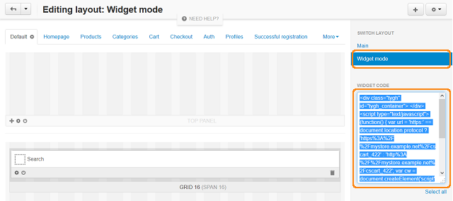
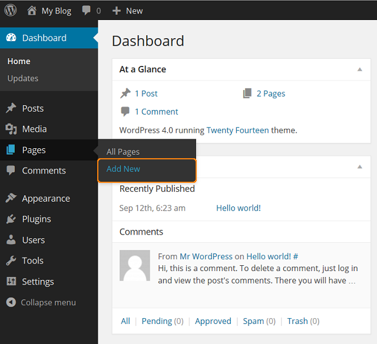

**********************************************
How To: Add a CS-Cart Site to a WordPress Page
**********************************************

The **Widget mode** allows you to embed the CS-Cart store to your WordPress site in just several steps.

First of all open your CS-Cart Administration panel and do the following:

*   Go to the **Design > Layouts** section.
*   In the right side panel find the **Switch layout** section and choose **Widget mode**. You can also choose any other layout.
*   In the **Widget code** section copy the given code to clipboard.

After that, log into your WordPress administration panel and follow these steps:

*   In the left panel choose **Pages > Add New**. You can also choose **Pages > All Pages** to edit one of the existing pages.

*   On the opened page speсify the title and simply paste the widget code from clipboard to the given text area.
*   Click the **Publish** button in the right section.

.. image:: img/widget_03.png
    :align: center
    :alt: New Page

*   Click **View Page** near the **Page published** notification to see this WordPress page with your CS-Cart store added.