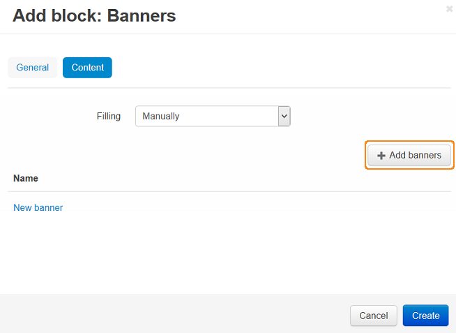

******************************************
How To: Add a Flash Banner to the Homepage
******************************************

To add a Flash Banner to the Homepage:

*   In the Administration panel, go to **Marketing > Banners**.
*   Click the **+** button on the right and in the new page:

    *   Specify the **Name** of the banner (e.g. *New banner*).
    *   In the **Type** select box select *Graphic banner*.
    *   Upload an image for the banner.
*   Click **Create and close**.

.. image:: img/banner_01.png
    :align: center
    :alt: New banner

To create a block for banners on the **Homepage**: 

*   Go to **Design > Layouts > Homepage**.
*   Click **+** in the desired container and choose **Add block**. 
*   Go to the **Create new block** tab and choose **Banners**. In the new window:

    *   Specify the **Name** of the block (e.g. *Banners*).
    *   Select *Carousel* in the **Template** select box and click the **Settings** link next to it:

	    *   **Navigation** — how you can switch between the banners in the storefront.
	    *   **Delay (in seconds)** — how quickly the banners change.

.. image:: img/banner_02.png
    :align: center
    :alt: Banners block

*   Go to the **Content** tab and choose *Manually* as **Filling**. 
*   Click **Add banners** and choose banners you want to display in the storefront. Click **Add banners and close**.
*   Click **Create**.

