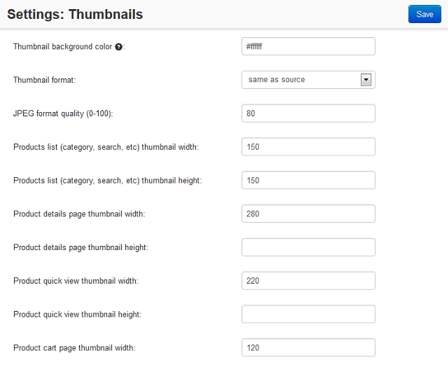

*************************
How To: Manage Thumbnails
*************************

By default the thumbnails for products are created automatically from the detailed images.

In order to upload the thumbnails manually:

*   In the Administration panel, go to **Products → Products**.
*   Select the product, for which you want to add a thumbnail and click on its name.
*   In the **General** tab next to the image of the product click the **upload them manually** link.

.. image:: img/thumbnails_01.png
    :align: center
    :alt: General tab

*   Upload a file for the **Thumbnail** in the opened form.

.. image:: img/thumbnails_02.png
    :align: center
    :alt: Upload a file

*   Click the **Save** button.

In order to change the thumbnail size and appearance settings:

*   Go to **Settings → Thumbnails**.
*   Change the settings.
*   Click the **Save** button.

.. note ::

	After changing these settings you will need to clean up the thumbnail cache in order to re-generate the automatically created thumbnails. To do it, go to **Administration → Storage → Clean up generated thumbnails**.

.. note ::

    Detailed pictures are displayed in the viewing larger image window, created thumbnails are displayed on the product details page. If you add additional images for the product, additional small thumbnails are created and displayed under the main image on the product details page.

