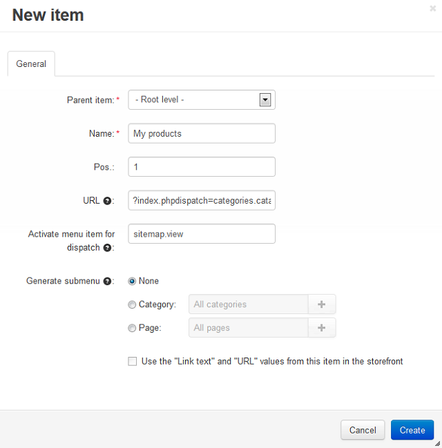

****************************************
How To: Add a New Menu to the Storefront
****************************************

*   In the Administration panel, go to **Design > Menus**.
*   Click the **+** button to add a menu.
*   In the appeared window, specify the **Name** of the menu (e.g. *New menu*).

.. image:: img/menu_01.png
    :align: center
    :alt: New menu

*   Click the **Create** button.
*   Click the gear button next to the created menu, choose **Manage items**, and in the opened window click the **+** button.
*   In the appeared window specify:

    *   **Parent item** - Select the necessary parent level.
    *   **Name** - Type the name of your item (e.g. *New Item*).
    *   **Pos.** - Specify the link position.
    *   **URL** - Enter the URL of the page which will open when the link is clicked on (e.g. *index.php?dispatch=categories.catalog*).
    *   **Activate menu item for dispatch** - Specify the pages on which to display the tab as active (e.g. *sitemap.view*).

        .. note ::

        	If you use two or more pages, leave this field empty.

    *   **Generate submenu** - Select whether submenu containing child elements of the selected object (*None* = no submenu; *Category* = subcategories of the selected category; *Page* = child pages of the selected page) should be generated.
    *	**User-defined CSS class** - User-defined CSS class will be added to the menu item, so this will allow to define the menu item with its own CSS style.

*   Click the **Create** button.

