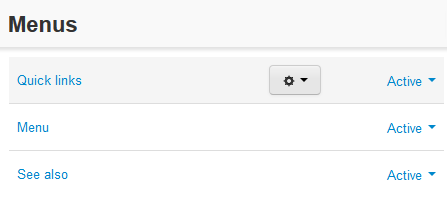

*****
Menus
*****

Use this section to create custom storefront menus. Each menu can be added to the storefront in **Design → Layouts** through a block of the *Menu* type.

Use the **+** button to add new menu, or click the **gear** button and choose **Edit** to edit existing menus.

To edit or add a menu fill in two mandatory fields:

*	**Name** - The name of the menu as it appears in the storefront.
*	**Status** - Current status of the menu (*Active* or *Disabled*).

In this section
***************

.. toctree::
    :maxdepth: 2
    :titlesonly:
    :glob:

    *
