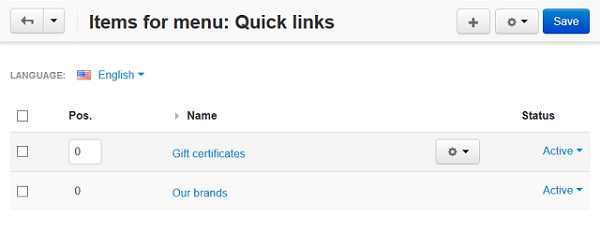

*************************
How To: Manage Menu Items
*************************

To manage the content of the menu:

*	In the Administration panel, go to **Design > Menus** and click the gear button of the desired menu.
*	Choose **Manage items** from the drop down list.

Here you can edit or delete each item (the gear button), or add new items to the list with the **+** button.

To edit or add the item, fill in the form with the following attributes:

*	**Parent item** – Choose whether it is a tab or an item appearing in a drop-down submenu.
*	**Link text** – Name of the item/tab as it appears on the storefront.
*	**Position** – Position of the item relatively to the position of the other items of the same level.
*	**URL** – URL of the linked page. It should not necessarily be an absolute URL consisting of the access protocol, the domain name, and the path to the page. A relative link like *index.php?dispatch=pages.view&page_id=3* would be enough.
*	**Activate menu tab for** –  Components pages of the storefront, where the items appear.
*	**Generate submenu** –  Select whether submenu containing child elements of the selected object (*None* = no submenu; *Category* = subcategories of the selected category; *Page* = child pages of the selected page) should be generated.