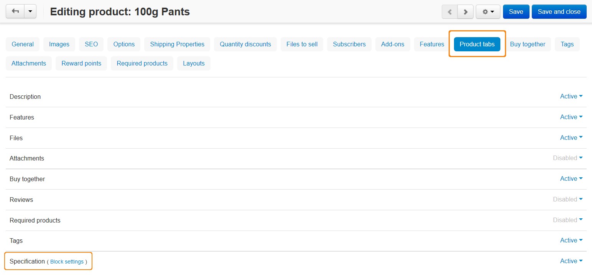

*************************************************
How To: Add a New Tab for the Product Detail Page
*************************************************

================
Adding a New Tab
================

To add a new tab with the own manageable content to the product detail page:

1.   In the Administration panel, go to **Design → Product tabs**.
2.   Click the **+** button to add a tab. In the opened window:

    *   Enter the tab name (e.g. *New tab*).
    *   Select the **Show this tab in a popup window** checkbox if you want to show the tab as a popup window.
    *   Click the **Select Block** button, go to the **Create New Block** tab and choose the **HTML block**. In the appeared window:

        *   Enter the name (e.g. *Specifications*).
        *   Specify block content in the **Content** field on the **Content** tab.
        *   Click the **Create** button to create the block.

    *   Click **Create** to create the tab.

.. image:: img/new_tab.png
    :align: center
    :alt: New tab

==========================
Changing the Block Content
==========================

You can change the block content for a particular product individually. To do it:

1.	Go to **Products → Products** and choose the desired product.
2.	Switch to the **Product tabs** tab and click the **Block settings** link near the previously created tab name.

3.	On the opened page choose the **Content** tab and change the filling of the **Content** field.

.. image:: img/tab_content_01.png
    :align: center
    :alt: The Content tab.

4.	Click the **Save** button.
