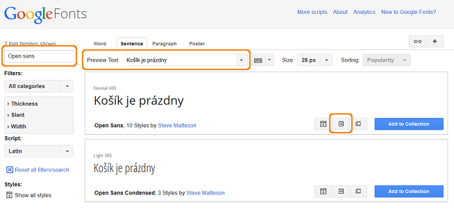
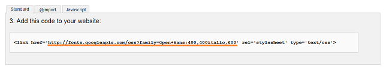

****************************************************************
Problems with Displaying Diacritic Symbols when Using Some Fonts
****************************************************************

When customising a store in the Visual Editor, you can choose different fonts to be used on the storefront. If a language with diacritic symbols is used in your store, you may experience problems with displaying such symbols when using some fonts. If so, try to do the following:

*   Go to `Google Fonts <https://www.google.com/fonts/>`_ and choose the desired font. Open Sans, for example.
*   Make sure that the selected font supports non-standart (diacritic) symbols:

    *   In the **Preview Text** input field type the text with diacritic symbols.
    *   Click the **Enter** button on your keyboard.

If the symbols display correctly in the text appeared in the field below, the selected font supports diacritic symbols.

*   Click the **Quick-use** button near the **Add to collection** button.
*   In the opened window tick the checkboxes of the desired font styles.
*   In the **Choose the character sets you want** section choose *Latin Extended (latin-ext)*.
*   Find the **Add this code to your website** section below.

*   Copy only URL from the given code. For example, if you see *<link href='http://fonts.googleapis.com/css?family=Open+Sans:400,400italic,600' rel='stylesheet' type='text/css'>*, copy *http://fonts.googleapis.com/css?family=Open+Sans:400,400italic,600* to your clipboard.
*   Open this URL in a new window. You will see something like this:

.. code-block:: none

    @font-face {
      font-family: 'Open Sans';
      font-style: normal;
      font-weight: 400;
      src: local('Open Sans'), local('OpenSans'), url(http://fonts.gstatic.com/s/opensans/v10/cJZKeOuBrn4kERxqtaUH3VtXRa8TVwTICgirnJhmVJw.woff2) format('woff2'), url(http://fonts.gstatic.com/s/opensans/v10/cJZKeOuBrn4kERxqtaUH3T8E0i7KZn-EPnyo3HZu7kw.woff) format('woff');
    }
    @font-face {
      font-family: 'Open Sans';
      font-style: normal;
      font-weight: 600;
      src: local('Open Sans Semibold'), local('OpenSans-Semibold'), url(http://fonts.gstatic.com/s/opensans/v10/MTP_ySUJH_bn48VBG8sNSugdm0LZdjqr5-oayXSOefg.woff2) format('woff2'), url(http://fonts.gstatic.com/s/opensans/v10/MTP_ySUJH_bn48VBG8sNSnhCUOGz7vYGh680lGh-uXM.woff) format('woff');
    }
    @font-face {
      font-family: 'Open Sans';
      font-style: italic;
      font-weight: 400;
      src: local('Open Sans Italic'), local('OpenSans-Italic'), url(http://fonts.gstatic.com/s/opensans/v10/xjAJXh38I15wypJXxuGMBo4P5ICox8Kq3LLUNMylGO4.woff2) format('woff2'), url(http://fonts.gstatic.com/s/opensans/v10/xjAJXh38I15wypJXxuGMBobN6UDyHWBl620a-IRfuBk.woff) format('woff');
    }

*   Remove **http:** from the URLs in this code. You will get something like this:

.. code-block:: none

    @font-face {
      font-family: 'Open Sans';
      font-style: normal;
      font-weight: 400;
      src: local('Open Sans'), local('OpenSans'), url(//fonts.gstatic.com/s/opensans/v10/cJZKeOuBrn4kERxqtaUH3VtXRa8TVwTICgirnJhmVJw.woff2) format('woff2'), url(//fonts.gstatic.com/s/opensans/v10/cJZKeOuBrn4kERxqtaUH3T8E0i7KZn-EPnyo3HZu7kw.woff) format('woff');
    }
    @font-face {
      font-family: 'Open Sans';
      font-style: normal;
      font-weight: 600;
      src: local('Open Sans Semibold'), local('OpenSans-Semibold'), url(//fonts.gstatic.com/s/opensans/v10/MTP_ySUJH_bn48VBG8sNSugdm0LZdjqr5-oayXSOefg.woff2) format('woff2'), url(//fonts.gstatic.com/s/opensans/v10/MTP_ySUJH_bn48VBG8sNSnhCUOGz7vYGh680lGh-uXM.woff) format('woff');
    }
    @font-face {
      font-family: 'Open Sans';
      font-style: italic;
      font-weight: 400;
      src: local('Open Sans Italic'), local('OpenSans-Italic'), url(//fonts.gstatic.com/s/opensans/v10/xjAJXh38I15wypJXxuGMBo4P5ICox8Kq3LLUNMylGO4.woff2) format('woff2'), url(//fonts.gstatic.com/s/opensans/v10/xjAJXh38I15wypJXxuGMBobN6UDyHWBl620a-IRfuBk.woff) format('woff');
    }

*   Copy this code to clipboard.
*   In the Administrtion panel of your store, go to **Design > Themes** and click the **Visual Editor** button.

.. image:: img/fonts_03.png
    :align: center
    :alt: Visual Editor

*   If you use several languages in your store, switch to a language containing diacritic symbols.
*   In the **Customize** section choose *Custom CSS*.
*   Paste the code to the field given below. Save the changes.

.. image:: img/fonts_04.png
    :align: center
    :alt: Custom CSS

Now diacritic symbols for the selected font will be displayed correctly.

.. important::

	If you applied changes to the default style, you will be asked to create a new one first. Type a custom style name and click **OK**.