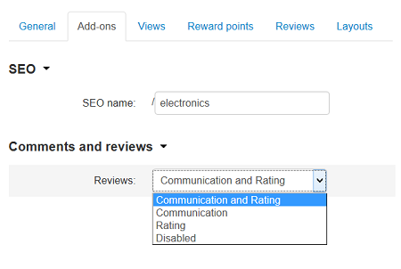

*******************
Category attributes
*******************

When you create or edit a category, your should specify a number of category attributes. For convenience, attributes are grouped under several tabs.

General
*******

Information
-----------

*	**Name** - Name of the category as it appears on the storefront and in the Administration panel.
*	**Location** - Position of the category in the category tree: a root category or a child category of a parent category.
*	**Description** - Description of the category as it appears on the storefront.

	The description that you enter here follows the category name and helps visitors understand what kind of product they should expect to find under the category. Besides, an informative description is just another SEO-wise opportunity.

	The description can be either a plain text or a formatted HTML text. If you are not familiar with HTML, you are encouraged to add a formatted description using the built-in WYSIWYG HTML editor.

*	**Status** - Status of the category (*Active* - category is available on the storefront, *Disabled* - category is not available on the storefront, or *Hidden* - category does not appear on the storefront, but customers can access it via a direct link).
*	**Store** - Store to which the category belongs.
*	**Images** - Pair of images to illustrate the category: a category thumbnail and a large category image.

	Both images can be either uploaded from a local computer or the server file system, or linked to a remote location where the required image is physically located.

	Images must be of one of the following formats only: JPEG, GIF, PNG. Maximum size of an uploaded image depends on your server configuration. As a rule, it should not exceed 2 MB.

	An alternative text describes an image in words. Technically, the text that you enter appears inside the ``alt=""`` and ``title=""`` attributes of the ```` HTML tag. The text is shown when the image is missing or cannot be displayed. It is good practice to have an alternative text associated with the image as an additional SEO-wise opportunity.

Meta data
---------

*	**Page title** - Title of the category page on the storefront, which is displayed in the web browser when somebody is viewing the page. Required for SEO purposes.
*	**META description** - Contents of the HTML meta tag describing the category. Required for SEO purposes.
*	**META keywords** - Contents of the HTML tag containing a list of search keywords for the category. Required for SEO purposes.

Availability
------------

*	**User groups** (requires commercial license) - `User groups <http://docs.cs-cart.com/4.3.x/user_guide/users/user_groups/index.html>`_ whose members can access the category.
*	**Position** - Position of the category relatively to the other categories of the same level. If no category positions are defined, categories are sorted alphabetically.
*	**Creation date** - Date when the category was added to the catalog.

Layouts
*******

This tab duplicates the global layout of the location to which this storefront page belongs (the **Design → Layouts** section of the Administration panel).

By using this tab, you can disable blocks that are globally enabled, and, on the contrary, enable blocks that are globally disabled. This makes it possible to configure an individual layout for different storefront pages.

Any modification that you make under this tab will not affect other storefront pages.

.. note::

	This tab is displayed only when you edit the existing category, not when create new.

.. note::

	For more information on blocks, see `Look and Feel → Layouts <http://docs.cs-cart.com/4.3.x/user_guide/look_and_feel/layouts/index.html>`_.

Add-ons 
*******

Applicable category attributes that depend on the active add-on modules. Requires commercial license.

*	**Age verification** - If selected, the access to the category is limited by the customer age.
*	**Age limit** - Minimum age for accessing the category and the products under the category.
*	**Warning message** - Message to be displayed if the customer does not qualify for the category contents.
*	**Reviews** - Customer reviews or ratings, or both.

.. important::

	The attributes require the `Age Verification <http://docs.cs-cart.com/4.3.x/user_guide/addons/age_verification/index.html>`_ and `Comments and Reviews <http://docs.cs-cart.com/4.3.x/user_guide/addons/comments_and_reviews/index.html>`_ add-ons to be enabled and configured.

Views 
*****

Appearance of the product under the category.

*	**Product details view** - Choose a template for all product details pages within the category.
*	**Use custom view** - If selected, you can choose a non-default view.
*	**Product columns** - Number of columns that the products under the category are displayed in. This option works for the *Grid* view only, but you can still use it with a custom view.
*	**Available views** - Select the category views that customers should be able to select from when viewing the category.
*	**Default category view** - Select the default category view.

Reward points
*************

Number of points that customers receive at their accounts when buying category products. Requires commercial license.

*	**Override global point value for all products in this category** - If selected, the below values prevail over the global points that are defined in the `Reward points <http://docs.cs-cart.com/4.3.x/user_guide/addons/reward_points/index.html>`_ section (**Marketing → Reward points**).
*	**User group** - `User group <http://docs.cs-cart.com/4.3.x/user_guide/users/user_groups/index.html>`_ whose members are granted reward points for buying the category products.
*	**Amount** - Number of reward points to be granted to a user group member who bought the category product.
*	**Amount type** - Absolute number of points or percentage-based value calculated in the following manner: the product cost is divided into 100, and the result is multiplied by the value in the field.

Reviews
*******

List of customers' reviews of the category. Requires commercial license. 

Requires that the **Reviews** field in the **Add-ons** tab be set to *Communication*, *Rating*, or both:

