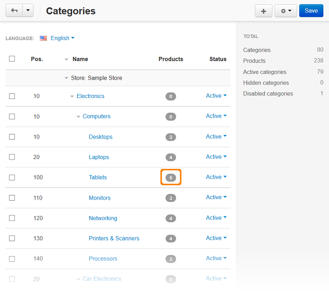

****************************
Sorting Products by Position
****************************

To sort the products by position:

*	In the Administration panel, go to **Products > Categories**.
*	In the **Products** column, click on the number corresponding to the amount of products under the necessary category.

*	On the opened page define the position of the products for the selected category.

.. image:: img/category_products.png
    :align: center
    :alt: Products of the category

.. important::

	The defined positions affect sorting only if the **Sort by Position: Low To High** or **Sort by Position: High To Low** sorting is selected on the product list page in the storefront.

	If you wish the **Sort by Position: Low To High** or **Sort by Position: High To Low** sorting to be the default sorting, when a visitor opens a category page, select the necessary variant in the **Product list default sorting** select box on the **Settings > Appearance** page. Make sure that these sortings are selected in the **Available product list sortings** section as well.