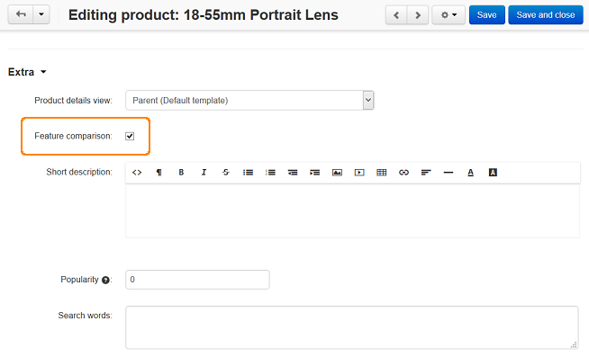
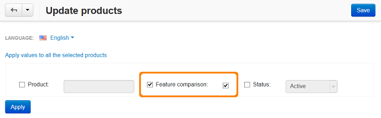

************************************
How To: Make two products comparable
************************************

To make two products comparable:

*   In the Administration panel, go to **Products > Products**.
*   Click on the necessary product to open its details page.
*   On the opened page, select the **Feature comparison** check box and click the **Save** button.
*   Repeat the same steps for the second product.

After that a customer will be able to compare these products by adding them to the compare list in the storefront.

.. important::

    To use this function some features should be defined for the products in the **Features** tab on the product details page.

To enable **Feature comparison** for several products at once:

*   Go to **Products > Products**.
*   Select all products by selecting the left top check box.
*   Click the gear button in the right corner of the page and select **Edit selected**.

.. image:: img/comparison_02.png
    :align: center
    :alt: Edit selected

*   In the opened **Select fields to edit** window, click on the **Unselect all** link and select only the **Feature comparison** check box. Click the **Modify selected** button.

.. image:: img/comparison_03.png
    :align: center
    :alt: Modify selected

*   Click on the **Apply values to all selected products** link. This will open a new small section.
*   Select the check box that is to the left of the **Feature comparison** option and the one that is to the right of it.
*   Click the **Apply** button. The selected value will be applied to all products.

.. note::

    To enable **Feature comparison** for a product using the :doc:`import <../import_export/product_import>` option, use the instructions from the :doc:`Imported fields format <../import_export/fields_format>` article.