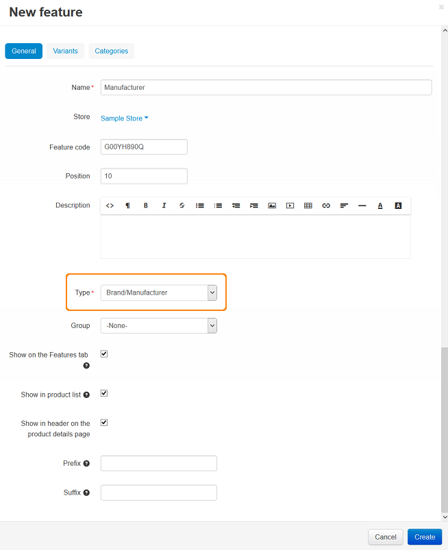
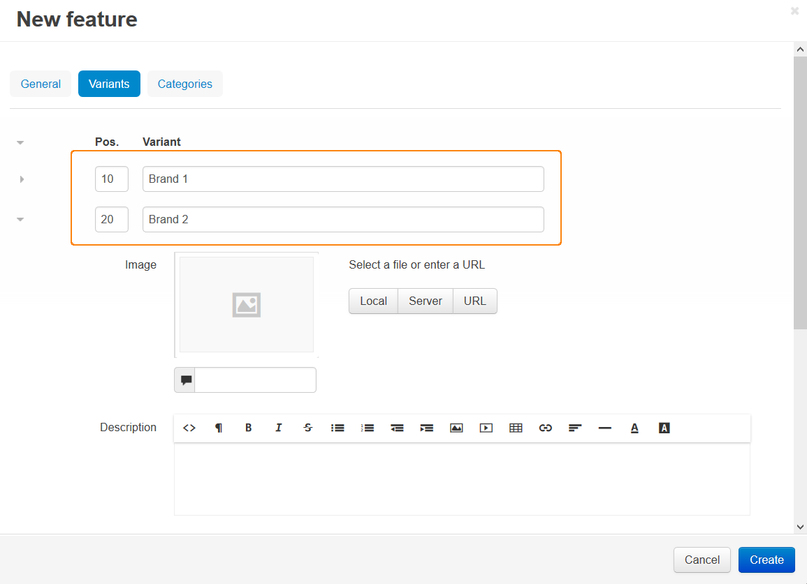

***************************************
Adding the Manufacturer Product Feature
***************************************

To add the Manufacturer product feature:

*   In the Administration panel, go to **Products > Features**.
*   Click the **+** button on the right, choose **Add feature** from the drop-down menu, and specify the following fields in the opened **New feature** window:

    *   **Name** - enter *Manufacturer*.
    *   **Feature code** - enter the individual code to identify the feature.
    *   **Position** - enter the feature position.
    *   **Description** - enter the feature description. It will be displayed if a customer clicks on **?** link under the **Features** tab on the product details page on the storefront.
    *   **Type** - select the *Selectbox > Brand/Manufacturer* feature type.
    *   **Group** - select the group to which the feature will be applied (in order not to apply the feature to any group, leave *None*).
    *   **Show on the Features tab** - If selected, the product feature is displayed on the product details page as a separate tab.
    *   **Show in product list** - If selected, the feature appears on the storefront on a product list page among the other product details.
    *   **Show in header on the product details page** - If selected, the feature is shown under the product header.
    *   **Prefix** - enter the feature prefix.
    *   **Suffix** - enter the feature suffix.

*   Open the **Variants** tab and specify the necessary manufacturers.
*   Click the **Create** button.

To specify a manufacturer for a product:

*   Go to **Products > Products** and click on the desired product link.
*   Open the **Features** tab.
*   Select the necessary manufacturer in the **Manufacturer** feature list and click the **Save** button.

.. note::

    To add a product filter so that it could filter products by manufacturer, read the :doc:`Adding a product filter <../filters/adding_filter>` article.