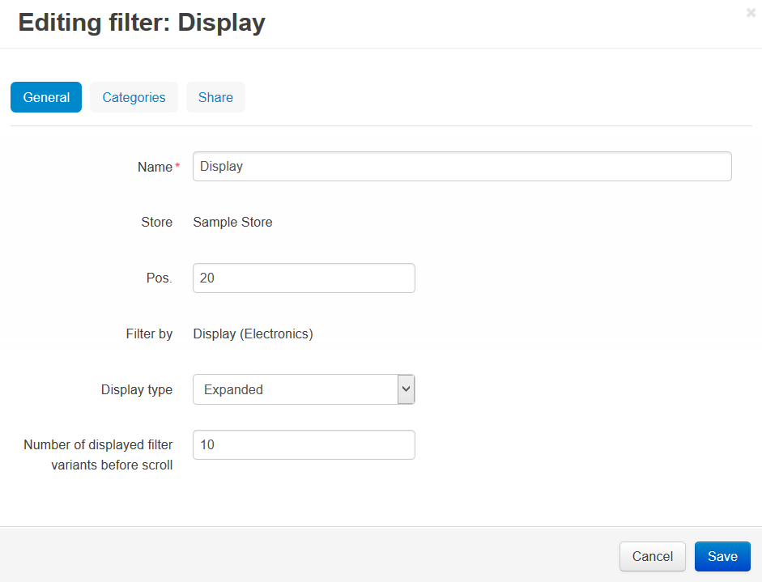

*****************
Filter Attributes
*****************

Attributes that can be assigned to a product filter are grouped under several tabs.

General
*******

*	**Name** – Name of the filter.
*	**Store** - Store to which the product filter originally belongs.
*	**Position** – Position of the filter relatively to the position of the other filters in the list.
*	**Filter by** – Parameter to filter the products by. This can be a default product field (price, free shipping) or an extra field (product feature) of one of the following types: select box and multiple check box.
*	**Display type** - Choose the manner in which filter will be displayed on the screen.
*	**Number of displayed filter variants before scroll** - choose the number of filter variants you want to be displayed on the screen. The other variants will be shown when scrolling a list.

Categories
**********

A list of categories on which pages the filter is displayed. If no category is specified, the filter will appear in all store categories.

Share
*****

Stores that share this product filter. Read `Sharing objects <http://docs.cs-cart.com/4.3.x/user_guide/stores/sharing.html>`_ for more details.