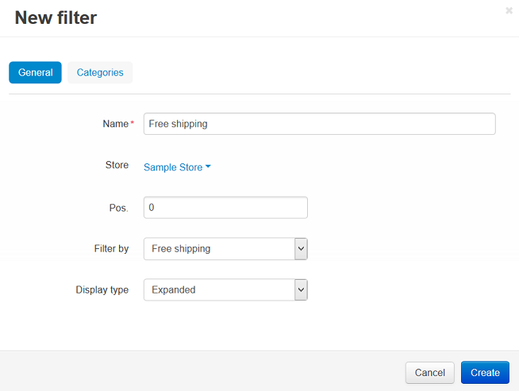

****************************************
How To: Filter Products by Free Shipping
****************************************

*   In the Administration panel, go to **Products → Filters**.

*   Click the **+** button on the right and specify the following fields in the opened **New filter** window:
     
    *   **Name** - enter *Free shipping*, for instance.
    *   **Store** - store to which a filter originally belongs.
    *   **Pos.** - enter the desired filter position.
    *   **Filter by** - select *Free shipping*.
    *   **Display type** - choose the manner, in which a filter will be displayed on the screen.

*   Open the **Categories** tab.

*   Click the **Add categories** button and add categories on which details pages this filter will be displayed.

.. image:: img/free_shipping_02.png
    :align: center
    :alt: Add categories

*   Click the **Create** button.
