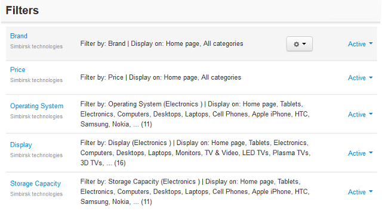

*******
Filters
*******

Product filters are displayed on the storefront and enable your customers to quickly find the products that meet specific parameters like the price range, manufacturer, etc. The parameters can be either the standard product fields or the extra fields defined in **Products → Features**.

You can make filters available in the entire store as well as in specific categories only.

.. important::

	If product filters do not appear on the storefront, please allocate a special block in **Design → Layouts**.

In this section
***************

.. toctree::
    :maxdepth: 1
    :glob:

    filter_attributes
    adding_filter
    filter_free_shipping