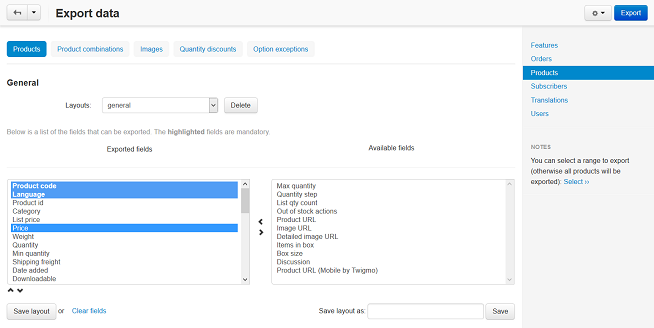
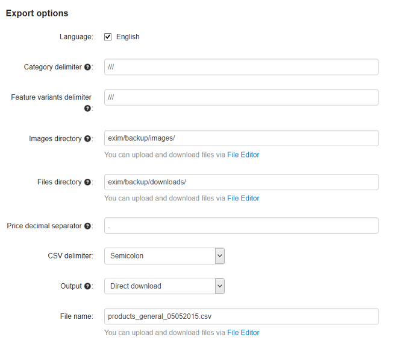

**************
Product Export
**************

To export product data:

*   In the Administration panel, go to **Administration → Export data → Products**.
*   Leave the necessary fields in the **Exported fields** option and move the others to the **Available fields** box.

*   Specify the following settings:

    *   **Language** - Select a language, that will be used for the CSV file.
    *   **Category delimiter** - Select a category delimiter, that will be used in the CSV file.
    *   **Feature variants delimiter** - Select a feature variants delimiter, that will be used in the CSV file.
    *   **Images directory** - Specify the path to the directory where images will be located. This will be used if the image file is specified without a path in the CSV file.
    *   **Files directory** - Specify the path to the directory where product files will be located. This will be used if the **File** field data is specified without a path in the CSV file.
    *   **Price decimal separator** - Type a decimal separator for product prices, that will be used in the CSV file.
    *   **CSV delimiter** - Select a CSV delimiter, that will be used in the CSV file.
    *   **Output** - Select the location to save the file to.
    *   **Filename** - Specify a new name of the file where data will be exported or leave the existing one in the input field of this option if **Direct download** is selected in the **Output** option.

*   Click the **Export** button if you need to export the data of all products.
*   Take the following steps if you need to export only several products:

    *   In the **Notes** section on the right, click the **Select** link.
    *   On the opened page, select the check boxes of the necessary products.
    *   Click the button with the gear icon in the right upper corner of the page and select **Export selected**.
    *   Click the **Export** button on the **Export data** page.