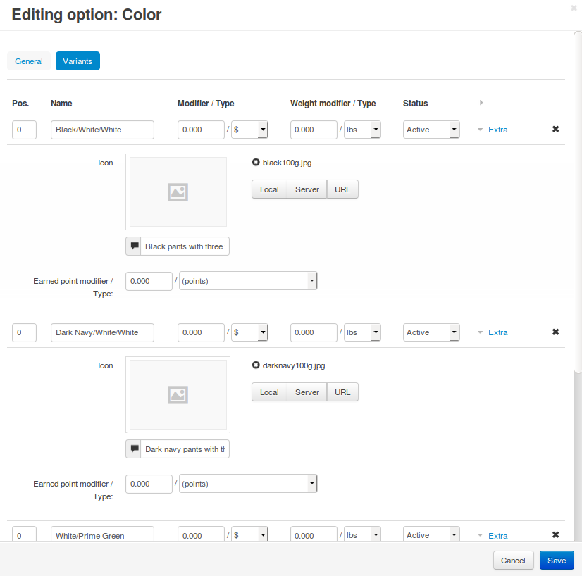

*************************************************************************
How To: Add Images for Option Variants and Combinations to a Product Page
*************************************************************************

.. note::

    **Tutorial Difficulty: 1 / 3**

When a product has multiple :doc:`option combinations <option_combinations>`, customers select the combination by choosing variants for every option. Let's enable customers to select variants by clicking on variant icons. We'll also make the main image of the product change when a customer selects a specific combination.

As a result, the page of your product will look like in the picture below:

.. image:: img/select_variant_with_icon.png
    :align: center
    :alt: When customers click on the icons, they select the desired variant of the product option. This changes the option combination and the image of the product.

=================================
Step 1. Icons for Option Variants
=================================

Let's add icons for option variants. By clicking these icons, customers will select the corresponding option variant.

1.1. In the Administration panel, go to **Products → Products**.

1.2. Click the name of the product you want to edit.

1.3. Switch to the **Options** tab.

.. image:: img/edit_option.png
    :align: center
    :alt: You can edit the option by clicking its name or clicking the gear button and choosing Edit.

.. note::

    We assume that you have already :doc:`created the options and their variants <product_options>` for the desired product.

1.4. Click the name of the option you want to edit.

1.5. Switch to the **Variants** tab.

1.6. Add icons for the option variants. Make sure to specify alternative text that will appear when the image can't be displayed for some reason—it's good for `SEO <https://en.wikipedia.org/wiki/Search_engine_optimization>`_.

1.7. Click **Save**.

.. important::

    The icons should then appear on the product page. Customers can select the option variant by clicking those icons. The main product image won't change, unless you follow instructions in step 2.

======================================
Step 2. Images for Option Combinations
======================================

Let's make it so that the main product image changes when a different option combination is selected.

2.1. In the Administration panel, go to **Products → Products**.

2.2. Click the name of the product you want to edit.

2.3. Switch to the **Options** tab and click **Option combinations**.

.. note::

	We assume that you have already :doc:`created option combinations <option_combinations>`. If the **Option combinations** button doesn't appear, then the product doesn't have options that can be a part of the combination.

.. image:: img/option_combinations_01.png
    :align: center
    :alt: The Options tab

2.4. Upload images for the necessary product option combinations. Make sure to specify alternative text that will appear when the image can't be displayed for some reason—it's good for `SEO <https://en.wikipedia.org/wiki/Search_engine_optimization>`_.

2.5. Click the **Save** button.

.. image:: img/combination_images.png
    :align: center
    :alt: Upload the images for option combinations from local computer, server file system, or from remote location by URL.

.. important::

    Now when a customer selects the option combination on the storefront, the image of that option combination will be displayed.

.. image:: img/changing_main_image.png
    :align: center
    :alt: If you followed the steps described this article, the main image of the product will change when customers choose a different option combination.
