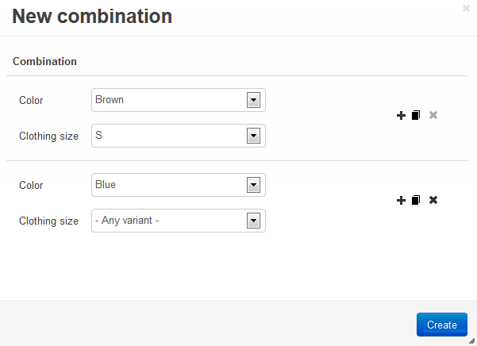

*****************************************
Allowed and Forbidden Option Combinations
*****************************************

You can determine what combinations of :doc:`product options <product_options>` are available or unavailable to customers. For example, if you sell a T-shirt in various colors and sizes, you can either make a certain color/size combination unavailable, or make it the only available combination. This is done via **exceptions**.

.. important::

    Exceptions can limit what :doc:`product option combinations <option_combinations>` can be added to cart. 

===============
Exception Types
===============

Exceptions behave differently depending on their type. You can specify the type of exceptions separately for each product:

1. Go to **Products → Products**.

2. Click the name of the product you want to edit.

3. Find the **Exceptions type** setting and choose its value:

   * **Allowed**—only exceptions will be available to customers; other combinations of option variants will be unavailable.

   * **Forbidden**—exceptions won't be available to customers; other combinations of option variants will remain available.

4. Click the **Save** button in the top right corner.

.. note::

    If you change the **Exceptions type** setting of the product, the type of all the existing exceptions of that product will change.

.. image:: img/exceptions_type.png
    :align: center
    :alt: All the exceptions of the product are always of the same type.

===================
Adding an Exception
===================

1. In the Administration panel, go to **Products → Products**

2. Click the name of the desired product.

3. Switch to the **Options** tab. 

4. Click the **Allowed combinations**/**Forbidden combinations** button.

.. hint::

    The name of the button depends on the **Exceptions type** setting of the product.

.. image:: img/forbidden_comb_01.png
    :align: center
    :alt: The Forbidden combinations button is above the list of options on the Options tab.

5. Click the **+** button.

6. A pop-up window will open. There you can select the option variants that comprise the exception. Use the buttons on the right to add, clone, and remove combinations from the list.

7. Click the **Create** button.

The combinations will be added to the list of exceptions:

* If the product has **allowed combinations**, customers will only be able to add these combinations of options to cart.

* If the product has **forbidden combinations**, customers won't be able to add those combinations to cart.

=======================================
How Exceptions Appear on the Storefront
=======================================

The **Exception style** setting under **Settings → General** determines how exceptions appear on the storefront. It has two values:

* **Hide exception** (default value)—some option variants will be hidden, so that customers won't be able to choose a combination that is unavailable. 

  For example you sell a T-shirt with **color** and **size** options. You make the combination of *white* color and *XXL* size unavailable via exceptions. Then *XXL* won't appear on the list of sizes when *white* is selected as color, or the other way round.

* **Show warning on exception**—all variants of product options will appear. If a customer chooses an unavailable option combination, the following message will appear: *Unfortunately this combination is not accessible*. Customers won't be able to add unavailable combinations to cart.
