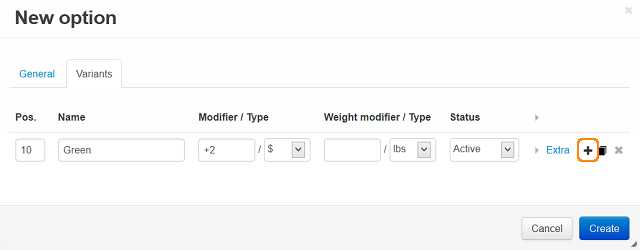

**********************
Global Product Options
**********************

If most of your products have the same product option, you can define this option on the **Options** page in the Administration panel. You will need to define the product option only once and then you will be able to add it to any product in one click (without necessity to add option variants to each product one by one).

To set global product options:

*   In the Administration panel, go to **Products > Options**.
*   On the opened page, click the **+** button and complete the following fields:

    *   **Name** - Name of the product option as it appears on the storefront.
    *   **Position** – Position of the product option relatively to the position of the other options in the list.
    *   **Store** - Store to which the option originally belongs.
    *   **Inventory** – If selected, the option has its own number of items in stock, which is tracked separately.
    *   **Type** – Type of the product option: *Select box*, *Radio group*, *Check box*, *Text*, *Text area*, or *File*.

        *   If the option type is *Text*, *Text area* or *File*, please refer to this :doc:`article <../options/option_settings>` in order to learn more about its settings.
        *   If the option type is *Select box* or *Radio group*, open the **Variants** section in the same window. Complete the **Name** input field (e.g. *Green*). In the **Modifier** input field, set the amount that will be added to the product price if this option is selected (e.g. *+2*). Leave it empty if the price will not change. To add more variants, click the **+** icon.

	.. image:: img/global_options_01.png
	    :align: center
	    :alt: New option

    *   **Description** - Description of the product option as it appears on the storefront under the question sign (?) next to the option name.
    *   **Comment** – Comment to be displayed below the option on the storefront.
    *   **Required** - If selected, this option is mandatory for selection/completion.
    *   **Missing variants handling** - Select how impermissible/missing option combinations should be handled: *Display message* - the option will be marked as not available, if the option is mandatory (see the previous setting) customers will not be able to add the product to the cart; *Hide option completely* - the option will be hidden, if the option is mandatory (see the previous setting) customers will be able to add the product to the cart.

*   Click the **Save** button to apply the changes.

To set a global product option for an individual product:

*   In the Administration panel, go to **Products > Products**.
*   Open any product details page and open the **Options** tab.
*   Click the **Add global option** button, select the necessary global option in the **Global options** select box and click **Apply**.

.. image:: img/global_options_03.png
    :align: center
    :alt: Add global option

.. important::

	If you select the **Apply as link** check box, the selected product option will be added to the product as a link. This means that you cannot edit the option for the current product, but the added product option will reflect all the changes made to it on the **Global options** page.
    
    If you do not select the check box, the option will be copied to the list of product options for the product, and you will be able to edit its variants at any time.