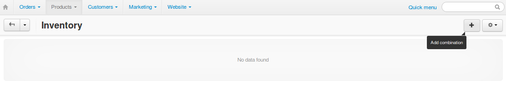

***************************
Product Option Combinations
***************************

To make inventory tracking easier, you can group different combinations of :doc:`product option variants <product_options>` under **option combinations**. For example, clothes come in various colors and sizes. Option combinations allow you to track separately, how many blue XL T-shirts and white M T-shirts you have. 

.. note::

   Only *Checkbox*, *Select box*, and *Radiogroup* options can be a part of a combination. An option must also have the **Inventory** checkbox ticked, or it won't appear among the options of the combination.

----------------
Add Combinations
----------------

1. In the Administration panel, go to **Products → Products**.

2. Click the name of the product you want to edit.

3. Set the **Inventory** setting to *Track with options* and click the **Save** button. This will allow you to track product quantity for each option combination separately.

4. Switch to the **Options** tab and click **Option combinations**. This will take you to the list of option combinations for this product.

.. important::

	The **Option combinations** button appears only if the product has options.

.. image:: img/option_combinations_01.png
    :align: center
    :alt: The Options tab

5. Click the **+** button on the right to add combinations manually.

.. hint::

    You can automatically create all possible option combinations for the product. To do that, click the gear button instead of **+**, and choose **Rebuild combinations**. This won't overwrite the existing combinations.

6. A pop-up window will open. There you can select the option variants that comprise the combination. Use the buttons on the right to add, clone, and remove combinations from the list.

.. image:: img/add_option_combinations.png
    :align: center
    :alt: You can add multiple option combinations at once.

7. Click **Create** to add the new option combinations to the list.

-----------------
Edit Combinations
-----------------

Once you create an option combination, you can't change what option variants are a part of it. If you open the list of existing option combinations of a product, you will only be able edit the following parameters:

* **code**
* **quantity** (only if you enable *tracking with options* for this product)
* **image** (:doc:`learn more about it here <comb_images>`)

Remember to click the **Save** button in the top right corner once you've made your changes.

.. note::

    The image added to the product option combination will be displayed on the storefront when a customer selects this option combination.

.. image:: img/option_combinations_02.png
    :align: center
    :alt: Inventory

-------------------
Delete Combinations
-------------------

* **Delete one combination**: hover over the combination, click the gear button, and choose **Delete**.

* **Delete multiple combinations**: tick the checkboxes of the combinations to be deleted, click the gear button in the top right corner, and choose **Delete selected**.

.. hint::

    Ticking the checkbox in the top left corner will select all the combinations on the current page.

.. image:: img/delete_combinations.png
    :align: center
    :alt: Delete multiple combinations by ticking their checkboxes and using the gear button in the top right corner.
