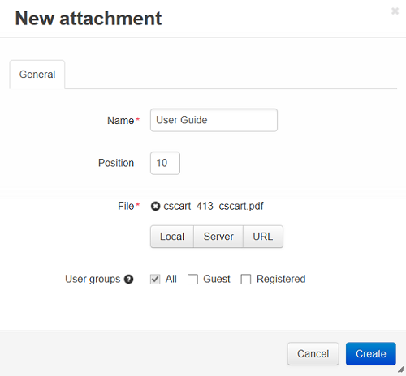

***************************
Attaching Files to Products
***************************

To attach a file to a product:

*	In the Administration panel, go to **Products > Products**.
*	Open the details page of the necessary product by clicking on its name.
*   Open the **Attachments** tab and click the **Add attachment** button.

.. important::

	The **Attachments** tab will display only if the **Attachments** add-on is activated in the **Add-ons > Manage Add-ons** section. This functionality is not available in CS-Cart Free.

*   In the opened form, specify the name of the new attachment and upload a file in the **File** section.
*   Click the **Create** button.

.. important::

	A customer will be able to download this file in the **Attachments** tab on the product details page in the storefront.

