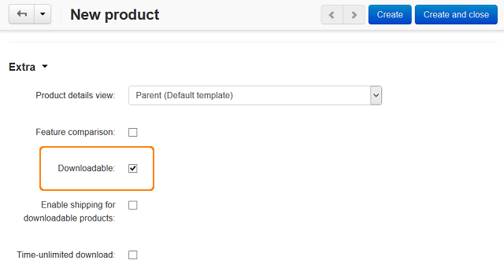
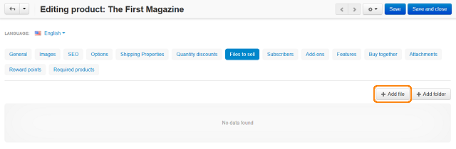
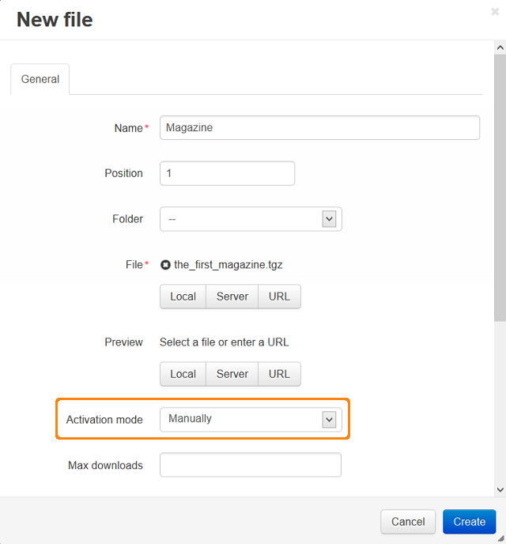

*********************
Downloadable Products
*********************

To create a downloadable product:

*	In the administration panel, go to **Products > Products**.
*	Click on a product name in the list or add a new product by clicking the **+** button.
*	Select the **Downloadable** check box in the **Extra** section.

.. important::

    This check box appears when the **Enable selling downloadable products** option is activated in the **Settings > General** section.

*	Select the **Enable shipping for downloadable products** check box if the product has a tangible component and it is required to display a shipping method.
*	Select the **Time-unlimited download** check box if you would like to make the product download period time-unlimited.

.. important::

    If the **Time-unlimited download** check box is selected, the **Download key TTL (for electronically distributed products), hours** setting on the **Settings > General** page (the **Catalog** section) in the administration panel does not affect the product. The **Download key TTL (for electronically distributed products), hours** setting defines time in hours within which the customer can download the file(s) after the purchase. This period can be prolonged for a certain order on the order details page.

*	Click the **Save/Create** button.

*	Open the **Files to sell** tab.
*	In this tab, click the **Add file** button. This will open a special form to complete. In the **File** section of the form, upload the necessary files.

*	Select one of the following variants in the **Activation mode** drop-down list:

    *	**Manually** - Select to allow a customer to download the uploaded file after the administrator has allowed it manually in the Administration panel. The administrator should select *Active* in the **Active** column in the **Downloads** tab on the order details page in the Administration panel.
    *	**Immediately** - Select to allow a customer to download the uploaded file immediately after the purchase.
    *	**After full payment** - Select to allow a customer to download the uploaded file after the order status has changed to **Processed** or **Completed**.

.. important::

    The **Download** link will appear on the order details page immediately after the order has been placed. It will lead to the download page containing the name of the file to be downloaded. When the download is permitted/activated, the string with the filename will be converted into a download link, and the customer will receive this link by email.

*	Click the **Create** button.

.. important::

    To make the product downloadable and add files to it using the `import <http://kb.cs-cart.com/product-import>`_ option, use the instructions from the `Imported fields format <http://kb.cs-cart.com/imported-fields-format>`_ article.

.. important::

    The uploaded files are stored in the *var/downloads* directory of your CS-Cart installation.
