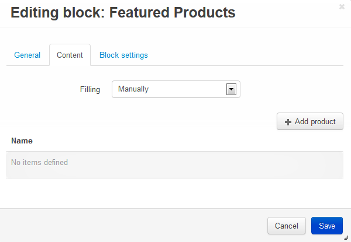

*****************
Featured Products
*****************

To change the existing set of products or add new ones to the **Featured products** section on the **Homepage**:

*   In the Administration panel, go to **Design > Layouts > Homepage**.
*   In the **Featured products** block, open the **Content** tab and click the **Add product** button.

To create the **Featured products** section (if you do not have one) on the **Homepage**:

*   Go to **Design > Layouts > Homepage**.
*   Click the **+** button in the necessary location and click **Add block**.
*   Open the **Create New Block** tab and in the opened section click the **Products** button.
*   In the opened section, specify the name of the new block and click the **Create** button. 
*   Click the gear button of the created block to open block options and select:

    *   **Grid** in the **Template** select box.
    *   **Mainbox simple** in the **Wrapper** select box.
    *   Desired css-class in the **User-defined CSS-class** input field.

*   Open the **Content** tab and select *Manually* in the **Filling** select box.

*   Click the **Create** button.

.. important::

    After the block is created or changed, make sure it is displayed correctly. Sometimes not all wrappers are suitable for a specific block type.