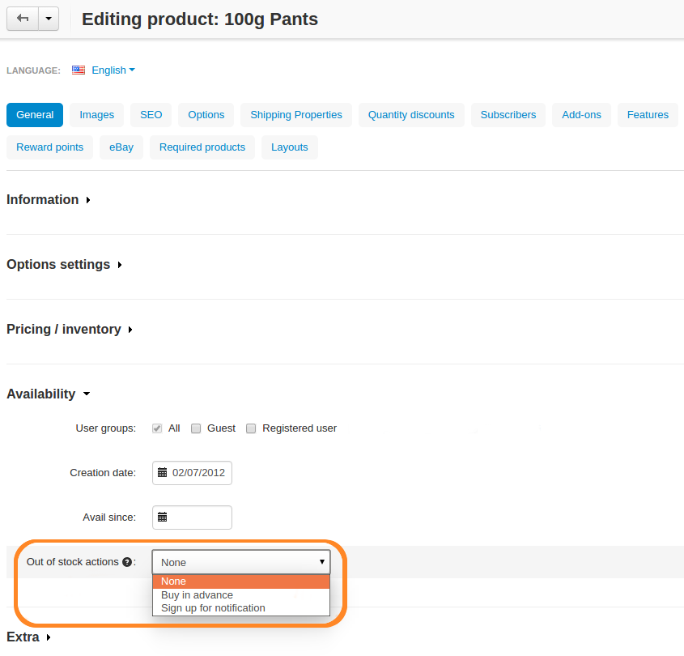
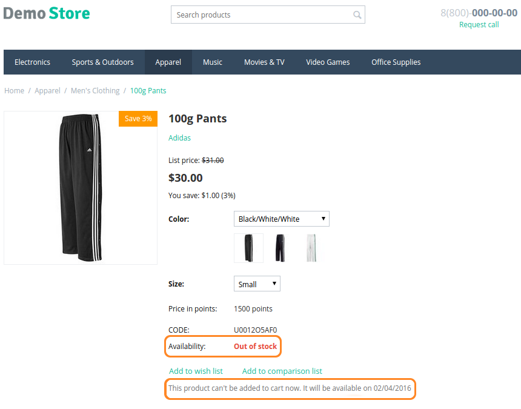
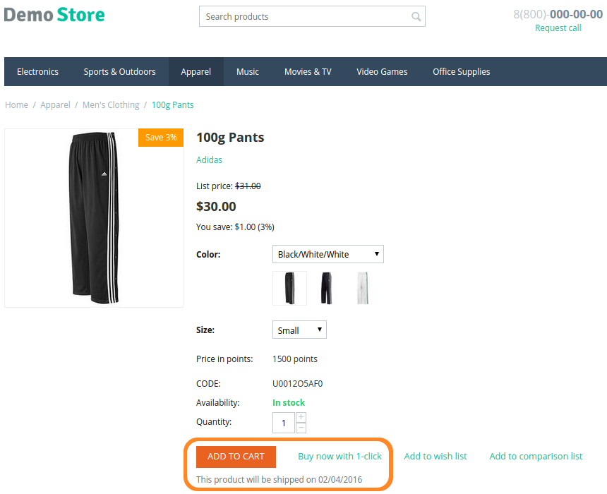
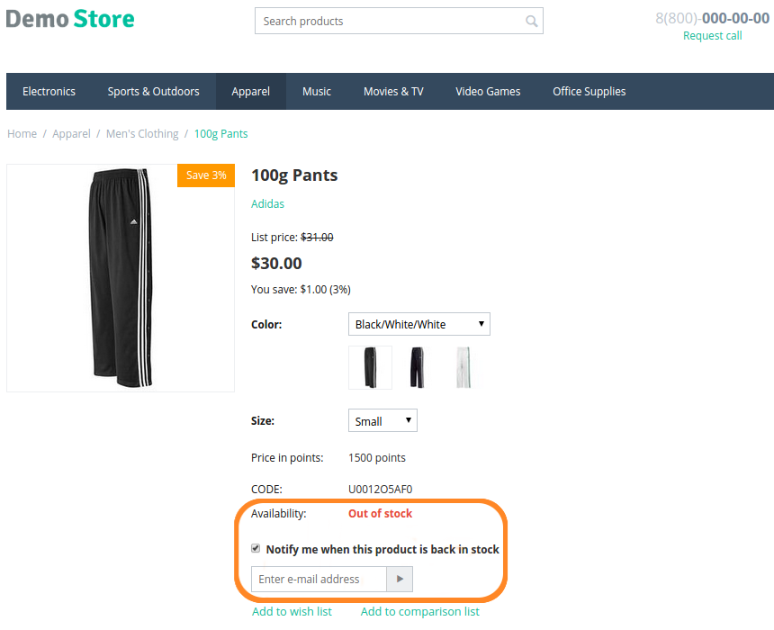

********************
Out of Stock Actions
********************

If a product runs out of stock or isn't available yet, you can still provide actions to your customers on the product page. 

Go to **Products → Products → <Desired Product>** and choose one of the following **Out of stock actions**: 

* **None**—forbid customers from buying the product, if the product is out of stock or if you specified the date when the product would be available.

* **Buy in advance**—allow customers to buy the product in advance, if you specified that the product would be available starting from a certain date.

  .. hint::

      Use the **Avail since** parameter of a product to specify when the product becomes available for purchase.

* **Sign up for notification**—offer customers to sign up for an email notification. They will receive an email once the product is in stock again.

.. important::

    If you set the **Inventory** parameter of a product to *Do not track*, the product will always be treated as in-stock. The same will happen if you go to **Settings → General → Catalog** and tick the **Allow negative amount in inventory** checkbox.

====
None
====

The **Add to Cart** button won't appear if:

* you have **0** items in stock and you don't allow negative amount of items in your inventory; or

* the product isn’t available yet because you have specified a later date in the **Avail since** field.

  .. note::

      If your product is supposed to be available starting from a specific date, your customers will see that date on the product page.

==============
Buy in Advance
==============

If you specify the **Avail since** date for a product, customers won't be able to buy it until that date. However, you set the **Out of stock actions** parameter of the product to *Buy in advance*. That will allow customers to buy that product.

.. important::

    To display the **Add to Cart** button on a product details page, you must have **more than 0 items** of the product in stock or **allow negative amount in inventory** under **Settings → General → Catalog**.

========================
Sign Up for Notification
========================

If a product is out of stock, you can allow users to sign up for an email notification:

* Registered users only need to tick the **Notify me when this product is back in stock** checkbox on the product page.

* Guests have to provide their email addresses to receive the notification.

The customers who signed up for the notification will receive an email when the product is in stock again.

.. important::

    The product must be **out of stock** for the notification checkbox to appear. The checkbox only appears on the pages of products that are **tracked without options**. 

----------------------------
Manage Product Subscriptions
----------------------------

You can view product subscriptions in 2 ways:

* To view all the product subscriptions, go to **Products → Products**, click the **gear button** in the top right corner, and choose **Product subscriptions**. You will see the list of products, as well as the number of subscriptions for those products in the separate column.

* To view subscriptions for a certain product, go straight to **Products → Products → <Desired Product>** and switch to the **Subscribers** tab.

.. image:: img/subscribers.png
    :align: center
    :alt: Every product has its own list of subscribers.

You can add subscribers to the list using these buttons:

* **Add subscriber**—enter the email address of a subscriber manually.

* **Select customer**—choose the registered customers you want to subscribe to email notifications about the product's availability.

.. important::

    Once a subscriber receives the email saying that the product is in stock, they are removed from the list of product subscribers automatically.

To remove subscribers from the list manually, tick the checkboxes next to their email addresses and click the **trash can button**.
