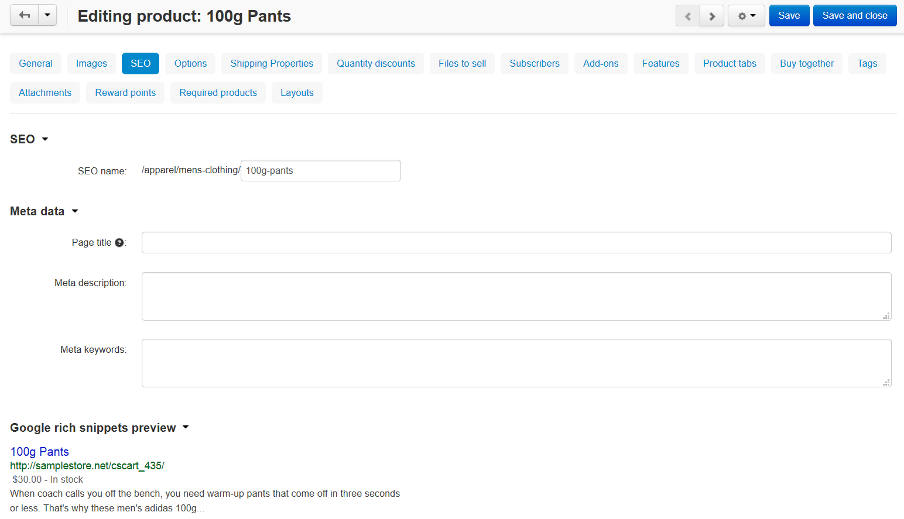
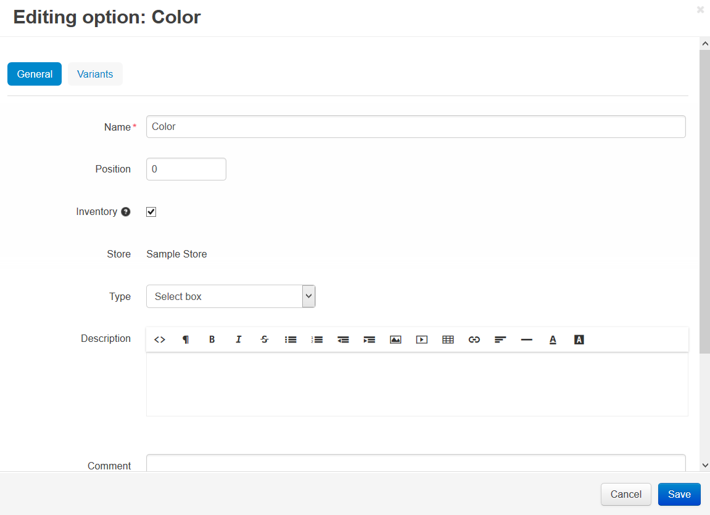

******************
Product Attributes
******************

When you create or edit a product, you should specify a number of product attributes. For convenience, attributes are grouped under several tabs.

.. image:: img/product_attributes_01.png
    :align: center
    :alt: Tabs

General
*******

Information
-----------

*	**Name** - Name of the product as it appears on the storefront and in the Administration panel.
*	**Categories** - Categories that the product will be assigned to. To define the product main category, select the corresponding radio button.
*	**Price** - Base product price in your store main currency.
*	**Full description** - Full product description appearing on the product details page of the storefront.

	The description can be either a plain text or a formatted HTML text. If you are not familiar with HTML, you are encouraged to add a formatted description using the built-in WYSIWYG HTML editor.

	An informative description not only helps your customers better understand whether they need this product, but it is also just another SEO-wise opportunity.

*	**Status** - *Active* - product is available on the storefront, *Disabled* - product is not available on the storefront, or *Hidden* – product does not appear on the storefront, but customers can access it via a direct link.
*	**Store** - Store to which the product originally belongs.
*	**Images** - Pair of images to illustrate the product: a product thumbnail and a large product image.

	Both images can be either uploaded from a local computer or the server file system, or linked to a remote location where the required image is physically located.
	Images must be of one of the following formats only: JPEG, GIF, PNG. Maximum size of an uploaded image depends on your server configuration. As a rule, it should not exceed 2 MB.

	An alternative text describes an image in words. Technically, the text that you enter appears inside the ``alt=""`` and ``title=""`` attributes of the ```` HTML tag. The text is shown when the image is missing or cannot be displayed. It is good practice to have an alternative text associated with the image as an additional SEO-wise opportunity.

.. note:: 

	By default thumbnails are generated from detailed images automatically, but you can upload them manually by clicking the **upload them manually** link.

Options settings
----------------

Requires commercial license.

*	**Options type** - Select a type of the product options, i.e. how this product options and variants appear on the storefront: *Simultaneous* - all options and variants appear simultaneously and independently; *Sequential* - options and variants are chosen successively one after another, and customers will be able to choose only the allowed option combination, avoiding exceptions.
*	**Exceptions type** - Select a type of the product options exceptions: *Forbidden* - all option exceptions are forbidden, and the customer cannot add the product with such option combination to the cart, all other option combinations become permissible; *Allowed* - all option exceptions are allowed, and the customer can add the product with such option combination to the cart, all other option combinations become impermissible. To specify product options, use the controls under the **Options** tab.

Pricing / inventory
-------------------

*	**CODE** - Internal product code (SKU number).
*	**List price** - Price suggested by the product manufacturer. Good practice is to show that your price is lower than the list price.
*	**In stock** - Number of products in the stock. By default, products that are out of stock do not appear on the storefront until you enable the **Allow negative amount in inventory** option in **Settings → General/Catalog**.
*	**Zero price action** - Allowed action on the product if the product has zero price. Allow or disallow users to add the products to the cart or ask users to enter a custom price.
*	**Inventory** - Way of tracking the inventory of the current product: track with product options or without product options or do not track at all. If the product is selected to be tracked with options, the common product quantity becomes unavailable, and you are supposed to specify the number of in-stock items individually for each product option/variant.
*	**Minimum order quantity** - Minimum number of product items that a customer must add to the cart to be able to order the product. The minimum amount always appears on a product details page of the storefront right after the product price.
*	**Maximum order quantity** - Maximum number of product items that a customer can order at a time. 0 means no maximum limit.
*	**Quantity step** - Number of product items between the two choices in the **Quantity** select box.
*	**List quantity count** - Maximum of choices in the **Quantity** select box.
*	**Taxes** – Select applicable taxes. To configure the set of available taxes, use the section `Shipping/Taxes <http://docs.cs-cart.com/4.3.x/user_guide/shipping_and_taxes/index.html>`_.

Availability
------------

*	**User groups** (requires commercial license) - `User groups <http://docs.cs-cart.com/4.3.x/user_guide/users/user_groups/index.html>`_ whose members can access the product.
*	**Creation date** - Date when the product was added to the catalog.
*	**Avail since** - Date when the product becomes available for sale.
*	**Out-of-stock actions** - Select if customers should be able to buy the product in advance before it is not yet available for sale, or sign up to receive an email notification when the product is available. Note that the **Buy in advance** option requires that you have the product in stock, while the **Sign up for notification** option requires that you have it out-of-stock. Also, the **Sign up for notification** option cannot apply to products which are tracked with options.

Extra
-----

*	**Product details view** - Choose a template for the page view.
*	**Feature comparison** - If selected, the product can be chosen for comparison. Availability of the feature comparison chart on the storefront is controlled by a separate block with the **Feature Comparison** content type (see section `Look and Feel → Layouts <http://docs.cs-cart.com/4.3.x/user_guide/look_and_feel/layouts/index.html>`_).
*	**Downloadable** - If selected, the product is labeled as downloadable, i.e. distributed by download.
*	**Enable shipping for downloadable products** - If selected, shipping is available for this downloadable product.

.. important::

	The **Enable selling downloadable products** checkbox must be chosen in the **Settings → General → Catalog** section to enable this functionality.

*	**Time-unlimited download** - If selected, the product download period never expires. As a rule, download links expire after a certain period of time that is controlled by **Download key TTL** option in **Settings → General**.
*	**Short description** - Short product description appearing on a product list page of the storefront.

	The description can be either a plain text or a formatted HTML text. If you are not familiar with HTML, you are encouraged to add a formatted description using the built-in WYSIWYG HTML editor.

	If you leave this field blank, the short description will be automatically taken from the full product description (first 300 characters).

*	**Popularity** - Integer conveying the product popularity, which is calculated automatically. This rating depends on the number of product views as well as the number of times the product was added to the cart and purchased. If necessary, you can manually adjust this value. Product popularity influences the way the products are arranged on the storefront.
*	**Search words** - List of words by which the product should be easily found in the built-in search facility.
*	**Promo text** - Type some important information about the product here in the form of a short message.

Images
******

This tab contains additional images for the product. Each additional image is represented as a pair of images: a thumbnail and a large pop-up image. Additional thumbnails appear on the product details page of the storefront beneath the main image thumbnail. And when a customer chooses to enlarge the active thumbnail, it expands into the large pop-up window.

.. image:: img/product_images.png
    :align: center
    :alt: Product images

Both images can be either uploaded from a local computer or the server file system, or linked to a remote location where the required image is physically located.

Images must be of one of the following formats only: JPEG, GIF, PNG. Maximum size of an uploaded image depends on your server configuration. As a rule, it should not exceed 2 MB.

An alternative text describes an image in words. Technically, the text that you enter appears inside the ``alt=""`` and ``title=""`` attributes of the ```` HTML tag. The text is shown when the image is missing or cannot be displayed. It is good practice to have an alternative text associated with the image as an additional SEO-wise opportunity.

SEO
***

*	**SEO name** - The value to which the standard URL will be changed.
*	**Page title** - Title of the product page on the storefront, which is displayed in the web browser when somebody is viewing the page. Required for SEO purposes.
*	**META description** - Contents of the HTML meta tag describing the product. Required for SEO purposes.
*	**META keywords** - Contents of the HTML tag containing a list of search keywords for the product. Required for SEO purposes.



In this section you can read more about `SEO <http://docs.cs-cart.com/4.3.x/user_guide/addons/seo/index.html>`_.

Options
*******

This tab allows you to manage the product options and option variants as well as controlling the option combinations and adding forbidden/allowed combinations.

.. image:: img/product_attributes_03.png
    :align: center
    :alt: Options

.. note::

	In this tab, you can also add a global option to the product. For instructions on how to use global options, please refer to the :doc:`Options <../options/index>` section of this guide.

Product options appear on the product details page on the storefront as selectable or input parameters to the product. Options can have the following attributes:

*	**Name** - Name of the product option as it appears on the storefront.
*	**Position** - Position of the product option relatively to the position of the other options in the list.
*	**Inventory** - If selected, the option has a separate number of items in stock, which is tracked separately.
*	**Store** - Store to which the option originally belongs.
*	**Type** - Type of the product option: *Select box*, *Radio group*, *Check box*, *Text*, *Text area* or *File*. For a specification of some of the option types, please refer to this :doc:`article <../options/option_settings>`.
*	**Description** - Description of the product option as it appears on the storefront under the question sign (?) next to the option name.
*	**Comment** - Comment to be displayed below the option on the storefront.
*	**Required** - If selected, this option is mandatory for selection/completion.
*	**Missing variants handling** - Select how impermissible/missing option combinations should be handled: *Display message* - the option will be marked as not available, if the option is mandatory (see the previous setting) customers will not be able to add the product to the cart; *Hide option completely* - the option will be hidden, if the option is mandatory (see the previous setting) customers will be able to add the product to the cart.



An option variant is an extension to the product option of type *select box*, *radio group* or *check box*, which may have a separate status, icon and amount of reward points as well as a weight modifier and a price modifier. Option variants have the following attributes:

*	**Position** - Position of the variant relatively to the position of the other variants in the list.
*	**Name** - Name of the product variant. For example, if the option is titled “Size”, the product variants to the option can be “small”, “medium”, “large”, etc.
*	**Modifier/Type** - Positive or negative value that modifies the original product price. The modifier can be either an absolute value or a percentage.
*	**Weight modifier/Type** - Positive or negative value that modifies the original product weight. The modifier can be either an absolute value or a percentage.
*	**Status** - Status of the product option variant (*Active* or *Disabled*).
*	**Icon** - Thumbnail to represent the option variant. The image can be either uploaded from a local computer or the server file system or linked to a remote location where the required image is physically located. An alternative text describes the image and is shown when the image is missing or cannot be displayed. It is good practice to have an alternative text associated with the image as an additional SEO-wise opportunity.
*	**Earned point modifier/Type** - Positive or negative value that modifies the original number of reward points that customers receive at their accounts when they buy the product. The modifier can be either an absolute value or a percentage.

Shipping Properties
*******************

This tab contains a number of product properties that are important for shipping this product to customers.

*	**Weight** - Weight of a single product item in the store default weight unit.
*	**Free shipping** - If selected, the product is delivered to the customer free of charge, i.e. no shipping cost for the product is calculated.
*	**Shipping freight** - Handling fee (insurance, packaging, etc.) added to the product cost.
*	**Items in a box** - Minimum and maximum number of product items to be shipped in a separate box.
*	**Box length** - Length of a separate box.
*	**Box width** - Width of a separate box.
*	**Box height** - Height of a separate box.

.. note::

	The last four options are required for a more accurate shipping cost estimation when a real-time shipping method with the support for multi-box shipping is used (UPS, FedEx, and DHL). If you do not specify box dimensions, values will be taken from the global configuration settings of a particular shipping carrier. Also see topic `Shipping and Taxes <http://docs.cs-cart.com/4.3.x/user_guide/shipping_and_taxes/index.html>`_.

Quantity discounts
******************

This tab contains a list of the product wholesale prices that have the following attributes:

*	**Quantity** - Minimum number of product items to qualify for the product wholesale price.
*	**Value** - Product wholesale price (per item).
*	**Type** - Type of the discount: *Absolute* - cost of 1 discounted item; *Percent* - percent discount off the base product item price. Percentage discount has certain natural limitations: the discount cannot be more than 100%, and the discount will not be saved as long as it applies to 1 product item and all user groups.
*	**User group** (requires commercial license) – `User groups <http://docs.cs-cart.com/4.3.x/user_guide/users/user_groups/index.html>`_ whose members can take advantage of the wholesale price.

.. image:: img/product_attributes_05.png
    :align: center
    :alt: Quantity discounts

More information about how to define wholesale prices for the product you can read `here <http://docs.cs-cart.com/4.3.x/user_guide/manage_products/products/wholesale.html>`_.

Files to sell
*************

Requires commercial license.

This tab contains a list of files that are associated with this `downloadable product <http://docs.cs-cart.com/4.3.x/user_guide/manage_products/products/downloadable.html>`_. Each file may have the following attributes:

*	**Name** - Name of the file as your customers will see it on the product page. Note that it does not change the original file name.
*	**Position** - Position of the file relatively to the position of the other files in the list.
*	**File** - File to be downloaded. The file can be uploaded from a local computer or the server file system, or be linked to a remote location where the file is physically located.
*	**Preview** - Preview file that can be freely downloaded from the product details page on the storefront.
*	**Activation mode** - Mode of download link activation: *Immediately* - immediately after the order has been placed; *After full payment* - once the order status has changed to **Processed** or **Complete**; *Manually* - manually by the store administrator.
*	**Max downloads** - Maximum number of allowed product downloads per customer.
*	**License agreement** - Text of the file license agreement.
*	**Agreement required** - Option to persuade customers accept the license agreement at checkout.
*	**Readme** - Text of the files *read me* file (e.g., installation instructions, etc.)
*	**Folder** - Choose a folder, to which the file belongs (if you created any).

Subscribers
***********

This tab contains a list of email addresses that visitors have left to receive a notification when the product is back in stock. To allow visitors to subscribe to an out-of-stock product, set the **Out of stock actions** option (see the **General** tab) to *Sign up for notifications*.

You can add the subscriber by his e-mail with the **Add Subscriber** button or you can choose subscribers among the customers of your store with the **Select customer** button.

Add-ons
*******

Product attributes that depend on the active add-ons.

*	**Returnable** - If selected, the product is labeled as available for the return.
*	**Return period** (requires commercial license) - Period of time following the day of purchase during which the product can be returned.
*	**Sales amount** - Number of sold product items. This value is calculated automatically if the **Bestsellers and on-sale products** add-on is active (**Add-Ons → Manage add-ons**). Yet, you can change the current value manually.
*	**Age verification** (requires commercial license) - If selected, the access to the product is limited by the customer age.
*	**Age limit** (requires commercial license) - Minimum age for accessing the product.
*	**Warning message** (requires commercial license) - Message to be displayed if the customer does not qualify for accessing the product.
*	**eBay template** - Choose one of the templates created in the **Marketing → eBay templates** section. This setting appears when the **eBay synchronization** add-on is installed and set up in the **Add-ons → Manage add-ons** section.
*	**Package type** - Type of product package. If you do not know your package type, select the *Large package* option. To ensure the most accurate cost, you will be asked to enter exact package dimensions. This setting appears when the **eBay synchronization** add-on is installed and set up in the **Add-ons → Manage add-ons** section.
*	**Override title and description** - Choose, if you want the original product name and description to be replaced with that, specified in the **ebay product title** and the **ebay product description** fields (you can see them below). This setting appears when the **eBay synchronization** add-on is installed and set up in the **Add-ons → Manage add-ons** section.
*	**eBay product title** - The title of the product to be used at eBay. This setting appears when the **eBay synchronization** add-on is installed and set up in the **Add-ons → Manage add-ons** section.
*	**eBay product description** - The description of the product to be used at eBay. This setting appears when the **eBay synchronization** add-on is installed and set up in the **Add-ons → Manage add-ons** section.
*	**Reviews** (requires commercial license) - Customer reviews or ratings, or both.

Features
********

This tab allows you to define the values of the extra fields that are valid for the product. The set of extra fields is controlled in **Products → Features**.

Product tabs
************

Requires commercial license.

In this tab, you can see the list of tabs, applied to the current product. Next to a tab name you can see its status — *Active* or *Disabled*. You can also see, how the product page looks like with the help of the gear button (on behalf of a customer - **Preview**, on behalf of admin - **Preview as admin**).

Editing and adding product tabs is done in the **Design → Product tabs** section.

Buy together
************

Requires commercial license.

In this tab, you can bind the product with other products from the catalog and offer a discount if the bound products are bought together. A set of the bound products is referred to as a *product combination*. The discount is promoted on the product details page on the storefront, and customers can decide whether they want to profit by the offer or not.

Along with the set of bound products and the offered discount, each combination has the following attributes:

*	**Name** - Name of the product combination.
*	**Description** - Description of the product combination as it appears on the storefront.
*	**Available from** - Date when the product combination becomes available for customers.
*	**Available till** - Date until the product combination is available.
*	**Display in promotions** - If selected, the offered product combination appears in **Products > Promotions**.
*	**Status** - Status of the product combination (*Active* or *Disabled*).

.. note::

	This tab is available when the `Buy together <http://docs.cs-cart.com/4.3.x/user_guide/addons/buy_together/index.html>`_ add-on is installed and activated in the **Add-ons → Manage add-ons** section.

Tags
****

This tab includes a list of tags associated with the product. Tags appear on the storefront in a special side box titled **Tag cloud**. For more information about the product tags, please refer to the section `Tags <http://docs.cs-cart.com/4.3.x/user_guide/addons/tags/index.html>`_.

*	**Tags** - Tags that have been added to the product. Start typing in this field to add a new tag. You can choose among the existing variants or create a new tag.

.. image:: img/product_attributes_06.png
    :align: center
    :alt: Tags

Attachments
***********

Requires commercial license.

This tab contains product attachments, which are files associated with the products. Unlike the contents of the **Files to sell** tab, the files that appear here are available for non-downloadable products as well. Each attachment can have the following attributes:

*	**Name** - Name of the product attachment.
*	**Position** - Position of the attachment relatively to the position of the other product attachments.
*	**File** - File that is used as the product attachment. The file can be uploaded from a local computer or the server file system, or it can be a link to a remote location where the file is physically located.
*	**User groups** - `User groups <http://docs.cs-cart.com/4.3.x/user_guide/users/user_groups/index.html>`_ whose members the attachment is available for.

In `this article <http://docs.cs-cart.com/4.3.x/user_guide/manage_products/products/attaching_files_to_products.html>`_ you can read more about attachments.

Required products
*****************

Requires commercial license.

This tab contains a list of required products, which must be bought together with this product. To add a new product, click the **Add product** button.

.. image:: img/product_attributes_07.png
    :align: center
    :alt: Required products

Reward points
*************

Requires commercial license.

Use this tab to set up the product price in reward points and specify the number of reward points to be earned for purchasing the product.

*	**Allow payment by points** - If selected, the product can be paid for with reward points.
*	**Override global PER** - If selected, the product has a fixed price in points that is independent of the point-to-money exchange rate.
*	**Price in points** - Fixed product price in points.
*	**Override global/category point value for this product** - If selected, the below values override the global reward points specified in **Marketing → Reward points**.
*	**User group** - `User groups <http://docs.cs-cart.com/4.3.x/user_guide/users/user_groups/index.html>`_ whose members are granted reward points for buying the product.
*	**Amount** - Number of reward points to be granted to the user group member who bought the product.
*	**Amount type** - Absolute number of points or percentage-based value calculated in the following manner: the product cost is divided into 100, and the result is multiplied by the value in the field.

Reviews
*******

Requires commercial license.

List of customers' reviews of the product. Requires that the **Reviews** field in the **Add-ons** tab be set to *Communication*, *Rating*, or both. In this tab, you can add own reviews and edit existing product reviews and ratings.

Layouts
*******

Contents of the product details page. Requires commercial license.

This tab duplicates the global layout of the location to which this storefront page belongs.

By using this tab, you can disable blocks that are globally enabled, and, on the contrary, enable blocks that are globally disabled. This makes it possible to configure an individual layout for different storefront pages.

Any modification that you make under this tab will not affect other storefront pages.

.. note::

	For more information on blocks, see `Look and Feel → Layouts <http://docs.cs-cart.com/4.3.x/user_guide/look_and_feel/layouts/index.html>`_.

.. note::

	Most of the attributes can be imported using `product import <http://docs.cs-cart.com/4.3.x/user_guide/manage_products/import_export/product_import.html>`_.