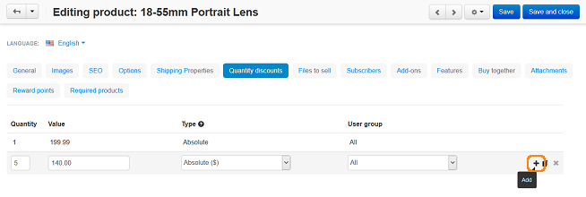
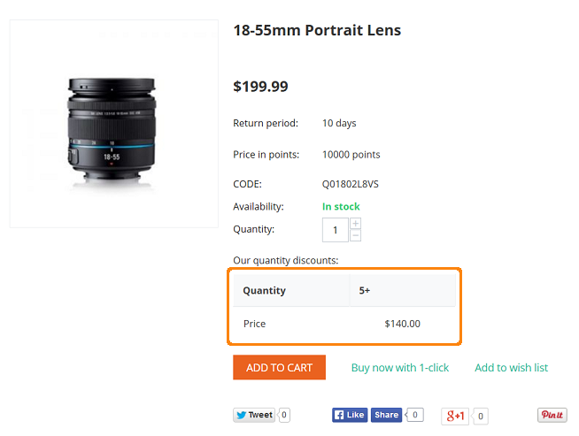

***********************************************
How To: Define Wholesale Prices for the Product
***********************************************

To define the wholesale prices for the product:

*   In the Administration panel, go to **Products → Products**.
*   Click on the name of the necessary product to open the **Editing product** page. Open the **Quantity discounts** tab.
*   In the **Quantity** input field, specify the minimum amount of products to which the wholesale price should be applied. In the **Value** input field, specify the wholesale price of the product.
*   To add more than one price, click on the **+** icon and specify a new amount of products and a wholesale price.
*   Click the **Save** button to apply the changes.

.. note::

    For example: Enter 2 into the **Quantity** input field and your price for a product (when a customer buys 2 or more items) into the **Value** input field next to it. Click the **Save** button.

.. note::

    In the **User group** select box, you can select a user group whose members will be able to purchase the product at the wholesale price after they have logged in.

The section with wholesale prices will be displayed for a customer on the storefront similar to the screenshot below:

