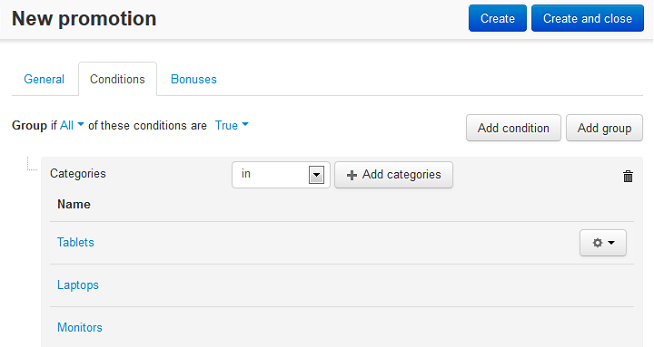

*********************************************
Discount on Products from Specific Categories
*********************************************

*   In the Administration panel, go to **Marketing > Promotions**.
*   Click the **+** button on the right and choose **Add catalog promotion**.
*   On the opened page, complete the information under the **General** section.
*   In the **Conditions** tab, click the **Add condition** button.
*   In the opened drop-down list box, select **Categories**. Then select in or not in, click the **Add categories** button and add categories which products will have a discount.

*   In the **Bonuses** tab, click the **Add bonus** button.
*   In the opened drop-down list box, select the necessary option. Then specify the necessary value in the opened input box.
*   Click the **Save** button.