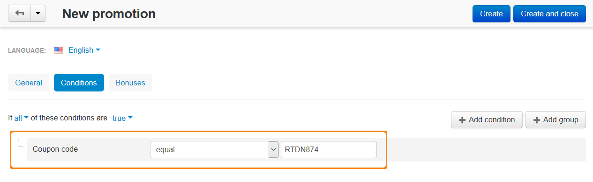
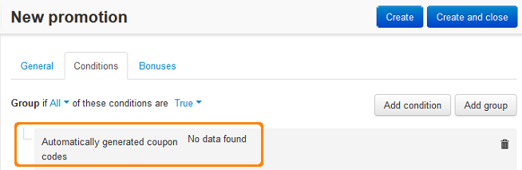

********************************
How To: Create a Discount Coupon
********************************

*   In the Administration panel, go to **Marketing > Promotions**.
*   Click the **+** button on the right and choose **Add cart promotion**.
*   Fill information in the **General** section.
*   Open the **Conditions** tab and click the **Add condition** button.
*   Select the **Coupon code** or the **Automatically generated coupon codes** option in the opened select box.

    If you selected the **Automatically generated coupon codes** option, system will do the next step automatically. If you selected the **Coupon code** option, then select the *in or equal* option in the opened select box and enter the desired text in the opened input box.

**OR**

*   Open the **Bonuses** tab and click the **Add bonus** button.
*   Select the desired option in the opened select box, then enter the desired value to the opened input box.
*   Click the **Save** button.

