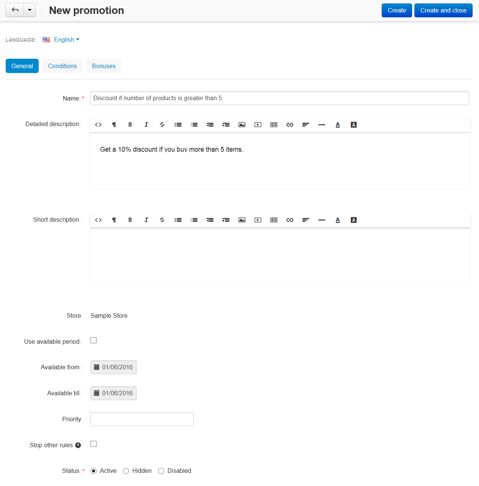
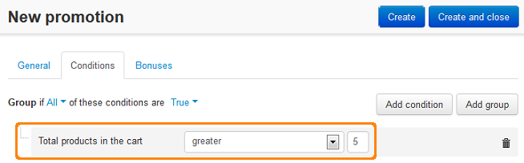
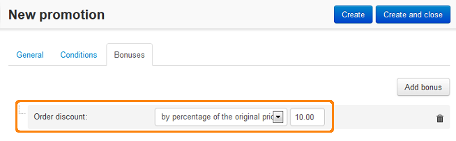

*******************************************************************
Discount on Order if Total Number of Products Exceeds Certain Value
*******************************************************************

*   In the Administration panel, go to **Marketing > Promotions**.
*   Click the **+** button on the right and choose **Add cart promotion**.
*   On the opened page, complete the information under the **General** section.

*   In the **Conditions** tab, click the **Add condition** button.
*   In the opened drop-down select box, select **Total products in the cart**. Then, select the necessary option and specify the necessary value.

*   In the **Bonuses** tab, click the **Add bonus** button.
*   In the opened drop-down select box, select the necessary option. Then, in the opened input box, enter the necessary value.

*   Click the **Create** button.