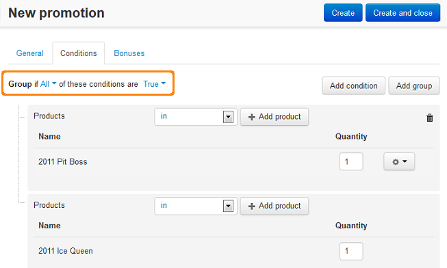
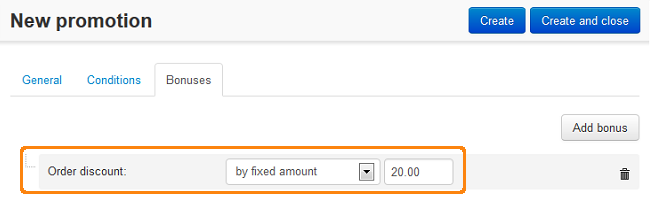

***************************************************************
Discount on the Order When Buying Two Special Products Together
***************************************************************

*	In the Administration panel, go to **Marketing > Promotions**.
*	Click the **+** button on the right and choose **Add cart promotion**.
*	Fill information in the **General** section.
*	Open the **Conditions** tab and click the **Add condition** button.
*	Select **Products** in the opened select box, then select **in** in the opened select box.
*	Click the **Add products** button, find and select the *product1* product in the opened window, click the **Add products and close** button.
*	Repeat actions listed in points 4-6 for the *product2* product.
*	In the **Group** option at the top select *All* in the first select box and *True* in the second select box.

*	Open the **Bonuses** tab and click the **Add bonus** button.
*	Select **Order discount** in the opened select box, select the desired option in the second opened select box and enter the desired value to the opened input box.
*	Click the **Create** button.

