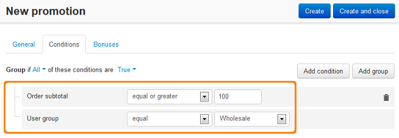
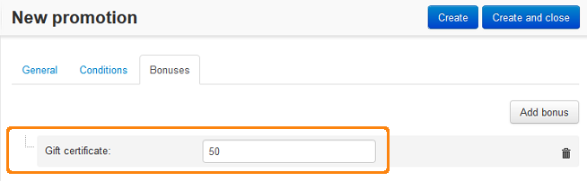

*******************************************************************************************************
How To: Give a Gift Certificate to a Customer of a Certain User Group if Order Total Exceeds Some Value
*******************************************************************************************************

*	In the Administration panel, go to **Marketing > Promotions**.
*	Click the **+** button on the right and choose **Add cart promotion**.
*	Fill information in the **General** section.
*	Open the **Conditions** tab and click the **Add condition** button.
*	Select **Order subtotal** in the opened select box, then select *equal or greater* in the opened select box and enter the desired value in the opened input box.
*	Click the **Add condition** button once again and select **User group** in the opened select box, then select *equal* in the opened select box and select the desired user group in the next select box.
*	In the **Group** option at the top leave *All* in the first select box and *True* in the second select box.

*	Open the **Bonuses** tab and click the **Add bonus** button.
*	Select **Gift certificate** in the opened select box and enter the desired value in the opened input box.
*	Click the **Create** button.

