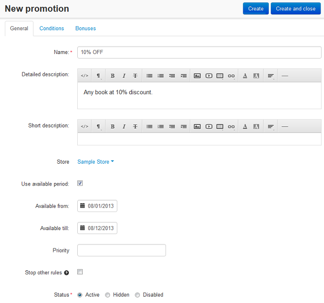
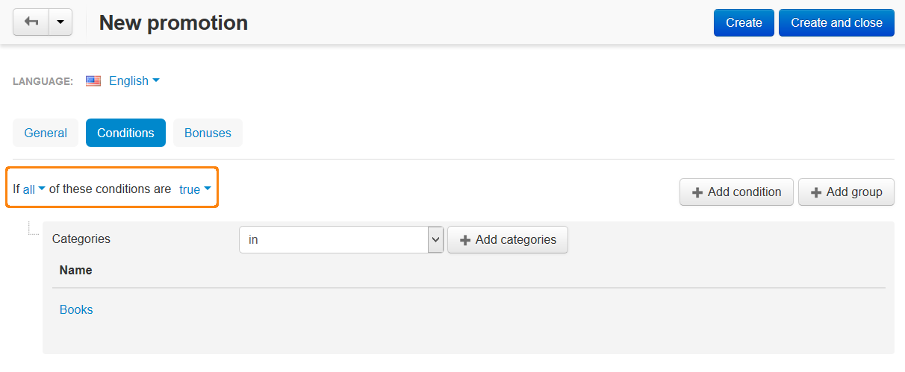

**************************
How To: Set up a Promotion
**************************

*   In the Administration panel, go to **Marketing > Promotions**.
*   Click the **+** button on the right and choose **Add cart promotion** or **Add catalog promotion**.

.. note::

	**Catalog promotions** are different product discounts which are displayed on the catalog pages, while **Cart promotions** allow to define not only discounts for products and orders, but also grant coupons, free shipping and free products. Cart promotions are displayed on the **Cart** and **Checkout** pages.

*   Fill information in the **General** section.

.. note::

	The **Stop other rules** option means the way a promotion is applied. If this option is enabled, the promotions with lower priority will not be applied. This option does not affect the promotions with the priority that is higher that the priority of the created promotion. The **Stop other rules** option affects only the promotion of the same type (catalog promotion or cart promotion) as the created one.

*   Open the **Conditions** tab and click the **Add condition** button.
*   Select the desired type of condition in the opened select box, then select the desired option in the opened select box or enter the desired value in the opened input box.

.. important::

	If you select several conditions, you should select the condition rules for them. In the **Group** option at the top select *All* or *Any* in the first select box and *True* or *False* in the second select box.

*   Open the **Bonuses** tab and click the **Add bonus** button.
*   Select the desired option in the opened select box. Then select the desired discount type. There are the following discount types:

    * *to percentage of the original price* - the original price will be reduced to the specified percentage.
    * *by percentage of the original price* - the original price will be reduced by the specified percentage.
    * *to fixed amount* - the original price will be reduced to a fixed amount.
    * *by fixed amount* - the original price will be reduced by a fixed amount.

*   Enter the desired value to the opened input box.
*   Click the **Create** button.

.. image:: img/promotions_03.png
    :align: center
    :alt: The Bonuses tab
