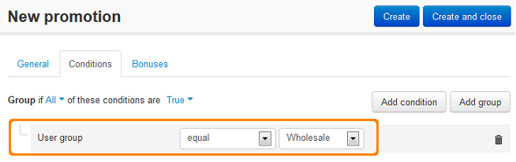
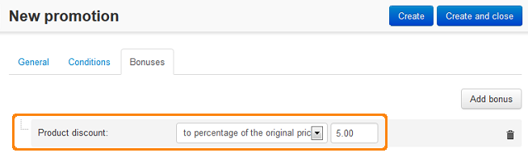

**********************************************
How To: Apply Discount to Specific User Groups
**********************************************

*   In the Administration panel, go to **Marketing → Promotions**.
*   Click the **+** button on the right and choose **Add catalog promotion**.
*   On the opened page complete the information under the **General** section.

.. image:: img/discount_for_usergroups.png
    :align: center
    :alt: New promotion

*   In the **Conditions** tab, click the **Add condition** button.
*   In the opened drop-down select box, select **User group**. Then, select *equal* or *not equal* and select the necessary user group.

*   In the **Bonuses** tab, click the **Add bonus** button.
*   In the opened drop-down select box select the necessary option. Then specify the necessary value.
*   Click the **Create** button.

.. note::

    This discount will be displayed to customers from the selected user group (the example in the screenshot is for the **Wholesale** user group) on the product list pages in the customer area.