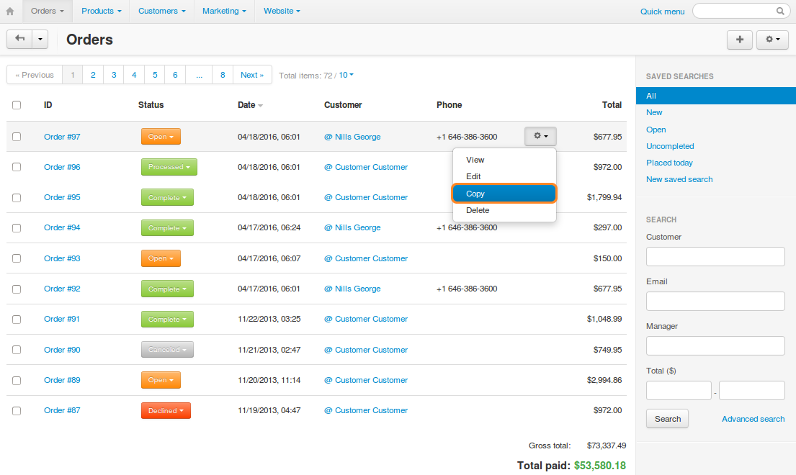
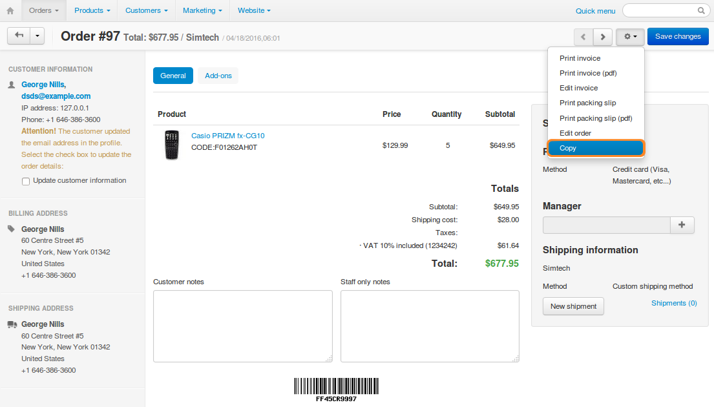

*******************
How To: Copy Orders
*******************

.. note::

    **Tutorial Difficulty: 1 / 3**
    
    This functionality was not available before CS-Cart & Multi-Vendor 4.3.7.

You can copy orders, so that you don't have to enter customer's information or specify the products ordered again.

To copy an order, follow these steps:

1. In the Administration panel, go to **Orders → View orders**.

2. Click the **gear** button of the order you want to copy.

3. Choose **Copy**.

You can also use the **gear** button on the order detail page under **Orders → View orders → <Desired order>**.

4. You will be taken to the order creation page, but the information from the copied order will be specified there.

5. Make any changes you need and click **Create**.

.. image:: img/copy_order.png
    :align: center
    :alt: You'll be taken to the order creation page when you copy an order.
