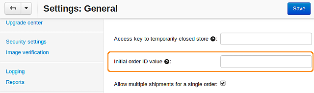

***********************************
How To: Define the Initial Order ID
***********************************

To define the initial order ID:

*   In the Administration panel, go to **Settings → General**.
*   Complete the **Initial order ID value** input field.

.. important ::

	The **Initial order ID value** can not be less than the last order number in the database. If you want to enter the value that is less than the last order number in the database, you should delete all orders in the database.

*   Click **Save**.

