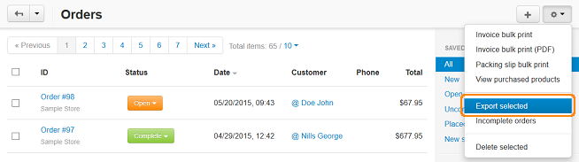

************
Order Export
************

To export an order:

*	In the Administration panel, go to **Administration > Export data > Orders**.
*	The **Orders** tab is opened by default. Use this tab to export the customer information and all other data about orders. Data of order products can be exported using the **Order items** tab.
*	Choose a layout:

	*	Choose the existing layout in the **Layouts** select box and click the **Export** button.

	.. note ::

		The existing layout can be modified. To do that, choose the layout in the **Layouts** select box, then choose fields in the **Exported fields** box, and click the **Save layout** button.

	.. image:: img/export_orders_01.png
	    :align: center
	    :alt: Choose Layout

	*	Create a new layout:

		*	In the **Exported fields** box choose fields which you want to export. To exclude a field from the **Exported fields** box, click its name and click the **>** button. To add a field from the **Available fields** box to the **Exported fields** box, click the name of the field and click the **<** button. 

	    	.. important ::

	    		The fields in the **Exported fields** box are to be exported.

		*	In the **Save layout as** input field under the **Available fields** box enter the name of the new layout.
		*	Click **Save**. 

		.. image:: img/export_orders_02.png
		    :align: center
		    :alt: Save layout

		*	Select the created layout in the **Layouts** select box and click the **Export** button.

*	In the **Export options** section in the **CSV delimiter** select box choose the type of delimiter.
*	In the **Output** select box choose an action on the file:

	*	**Direct download** — to save the file on the local computer.
	*	**Screen** — to display the file content.
	*	**Server** — to save the file on the server file system.

*	Enter a new name of the file where data will be exported or leave the existing one in the input field of the **Filename** option.

.. image:: img/export_orders_03.png
    :align: center
    :alt: Export options

*	To export *all orders* click the **Export** button.
*	To export *only several orders*:

	*	On the right side click the **Select** link next to **Notes**.
	*	Tick the check boxes next to the orders you want to export.
	*	Click the gear button and choose **Export selected**. Click the **Export** button on the opened page.

