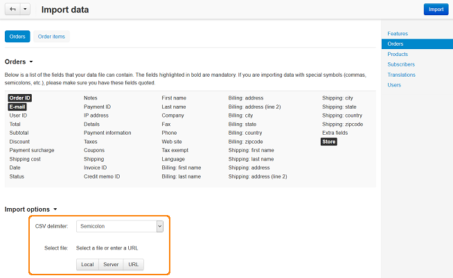

************
Order Import
************

To import an order:

*   In the Administration panel, go to **Administration > Import data > Orders**.
*   The **Orders** tab is opened by default. If you need to import the customer information and all other data about orders, use this tab. Data about order products can be imported in the **Order items** tab.

.. important ::

	The fields displayed in bold print in the **Order items** section must be in the file from which the data will be imported.

*   In the **Import options** section in the **CSV delimiter** select box choose the delimiter type.
*   In the **Select file** option choose location of the file with the import data.

.. note ::

	**For example:** If your file is located on your local computer, click the **Local** button.

*   Click the **Import** button.

