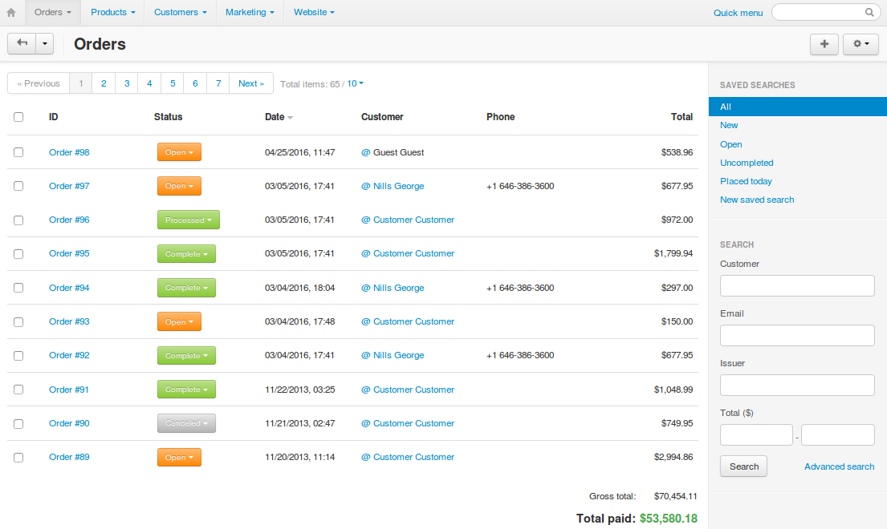

***********
View Orders
***********

When you open the **Orders → View orders** section, the system automatically lists all orders from the database, i.e. the orders that have ever been placed and not deleted. By default, the list is arranged according to the date when the orders were placed, with the most recent orders at the top.

.. note::

    Beginning with CS-Cart & Multi-Vendor 4.3.7, the order list also includes the managers assigned to the orders, and the names of the customers' companies.

.. hint::

     Click on the name of the corresponding column to sort orders by IDs, statuses, names, totals, or email addresses of users who placed the orders.

Use the search form on the right to display only those orders that satisfy a certain criterion or a combination of multiple criteria. By default, the form allows you to filter orders by:

* customer's name.

* customer's email address.

* the range of order totals.

.. hint::

    Click **Advanced search** for more filtering criteria. Beginning with CS-Cart & Multi-Vendor 4.3.7, you can search orders by the company of the customer (if specified).

If you filter orders against a particular search pattern regularly (e.g., to list all new orders that were paid with a gift certificate), you can save the pattern. It will appear the list of predefined patterns in the top left corner of the **View orders** section (see the picture below).

.. image:: img/orders_01.png
    :align: center
    :alt: Saved Searches

In the **View orders** section, you can do the following:

* Display a sorted list of all orders in the store or display a filtered list of orders that meets your search pattern only.

* View orders that were not completed—click the gear button and choose **Incomplete orders**.
	
.. note::
  
    An order has the **Incomplete** status while it is being processed by a payment system. For example, an order has this status while a customer is entering credit card details on the payment system website and up until the customer is redirected back to your store.

* Change order statuses on the fly.

* View and edit order details.

* Add comments to the order which are visible to the customer who placed the order.

* Export order details in the CSV, Quickbooks, and MYOB formats. If the MYOB and Quickbooks add-ons are installed and configured.

* Get orders from eBay. If the eBay synchronization add-on is installed and configured.

* Print invoices and package slips both separately for each order or in bulk.

* Remove credit card info (if any).

* Create orders.

* Delete existing orders.

* Copy orders.

.. note::

    Copying orders in the Administration panel was not available until CS-Cart & Multi-Vendor 4.3.7.
