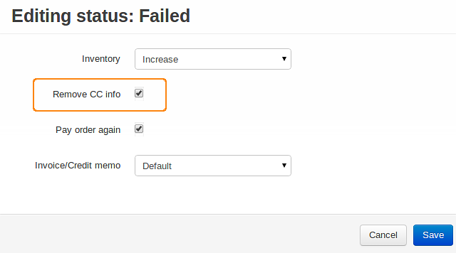

****************************************************************
How To: Remove Credit Card Information from Orders Automatically
****************************************************************

By default the credit card information is removed automatically for orders with any status. But if you have created a new order status and you want the credit card information to be removed automatically:

*   In the Administration panel, go to **Administration → Order statuses**.
*   Click on the name of the status.
*   Tick the **Remove CC info** check box.
*   Click **Save**.

.. note ::

	When an order has a status for which the **Remove CC info** option is enabled, the credit card information of this order will be removed.

