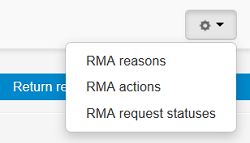

***************
Return Requests
***************

In the **Orders → Return requests** section you can handle product return requests that your customers have registered as well as configuring the general product return policy of your store.

.. note ::

	To allow return requests in your store, activate the `RMA <http://docs.cs-cart.com/4.3.x/user_guide/addons/rma/index.html>`_  add-on in the **Add-ons → Manage add-ons** section. There you can also configure some essential settings that relate to return requests.

The section consists of four subsections: **Return requests**, **RMA reasons**, **RMA actions**, and **RMA request statuses**. To switch between the subsections, use the gear button on the right.

In this section
***************

.. toctree::
    :maxdepth: 2
    :titlesonly:
    :glob:

    *
