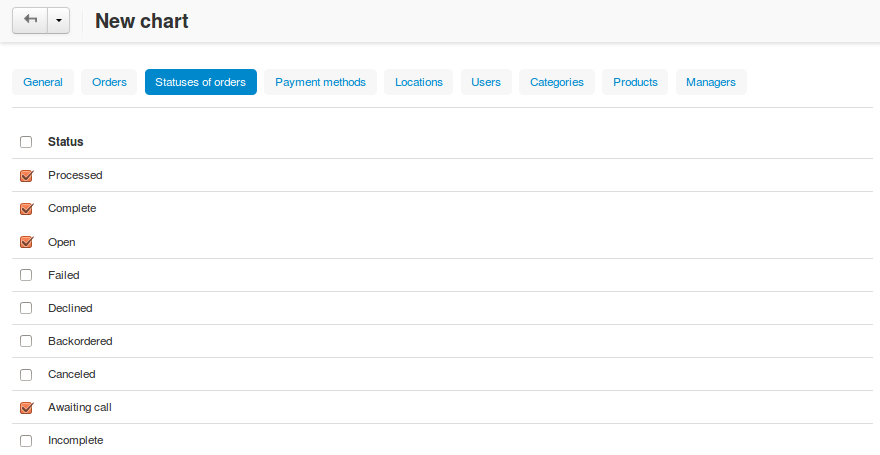

**********************
How To: Create a Chart
**********************

Data charts must be assigned to a particular :doc:`report<../sales_reports/create_report>`.

To add a chart to a report:

*	In the **Orders → Sales reports** section, click the gear button and choose **Manage reports** to display a list of all available reports.
*	Click the gear button corresponding to the required report and choose **Edit** from the drop-down list.

.. image:: img/reports_02.png
    :align: center
    :alt: Edit a report

This will open a page with the report details. The **Charts** tab contains a list of assigned reports (if any).

*	Click the **+** button.

.. image:: img/reports_03.png
    :align: center
    :alt: Add a chart

This will open a form with the chart details.

*	Complete the form.

Use the **General** tab to define the chart scope:

*	**Name** - Name of the chart as it will appear in the reports.
*	**Position** - Position of the chart relatively to the position of the charts in the report.
*	**Type** - How the data should be represented: graphically or in a table.
*	**Object to analyze** - Type of data to be reported on (users, orders and order statuses, products, categories, etc.)
*	**Value to display** - Aspect to be analyzed.
*	**Time interval** - Analyzed periods (day, week, month, year). Is not applicable to the chart type *Graphic [Pie 3D]*.

The tabs **Orders**, **Statuses of orders**, **Payment methods**, **Locations**, **Users**, **Categories**, and **Products** are used to filter or limit chart contents so that it covers specific items only.

For example, in the **Statuses of orders** tab you can select to show statistics on orders with specific statuses only, and in the **Products** tab you can choose the products which statistics should be represented in the chart. Statistics on the unchosen products will not be included in the chart.

*	Click the **Create** button.

The new chart will be listed among the other charts.