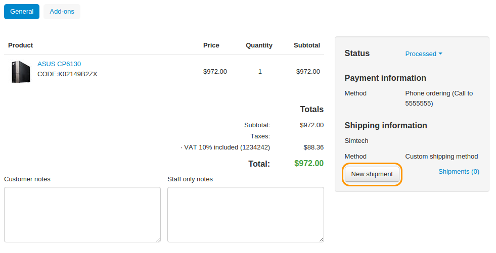
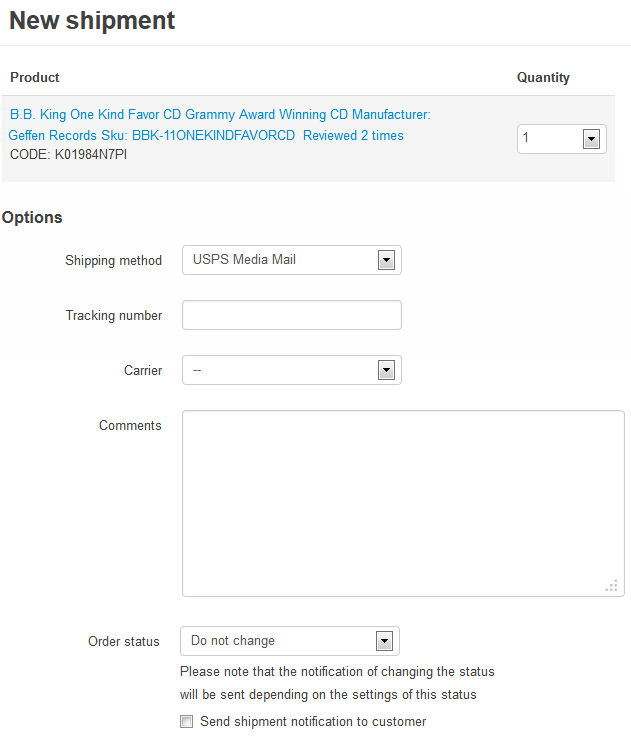

*************************
How To: Create a Shipment
*************************

.. note::

    **Tutorial Difficulty: 1 / 3**

Shipments are created separately for each order on the **order details** page in the **Shipping information** section.

=================
Create a Shipment
=================

1. Open the Administration panel of your store.

2. Go to **Orders → View orders** and choose the required order.

3. Click the **New shipment** button in the **Shipping information** section on the right. This will open a pop-up window.

4. For every product in the order, select the number of items that will be delivered in the current shipment.

.. note ::

    If you are going to deliver a particular product in a different shipment, select 0 (zero) from the **Quantity** drop-down list.

5. Choose a shipping method.

6. Optionally, enter a tracking number, choose a carrier, and add your comments.

7. Change the order status, if necessary.

8. Click the **Create** button.

===================
View Your Shipments
===================

1. Go to **Orders → Shipments** to find the list of all the shipments you've created.

.. image:: img/shipment_list.png
    :align: center
    :alt: You can view all the existing shipments under Orders → Shipments.

2. Click the **gear** button of the desired shipment and choose **View** to see the details of the particular shipment.

.. hint::

    Before CS-Cart & Multi-Vendor 4.3.7 you couldn't edit shipments, you could only delete them. Beginning with version 4.3.7, you can edit the comments and the date of the shipment. Remember to click **Save changes** once you've done that.   

.. image:: img/shipment_details.png
    :align: center
    :alt: Beginning with CS-Cart & Multi-Vendor 4.3.7, you can edit the comments and the date of the shipment.
