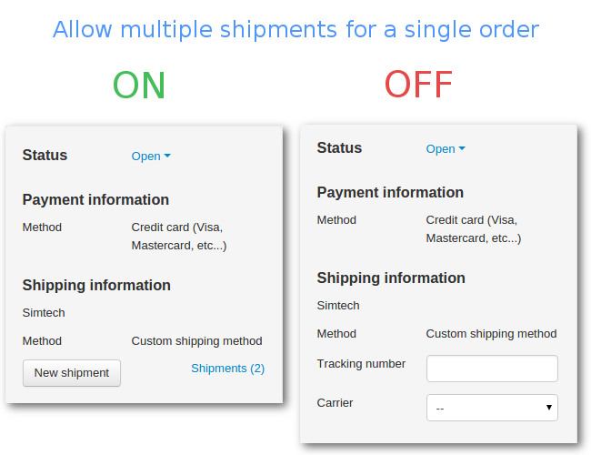
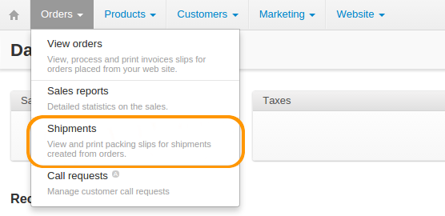

*********
Shipments
*********

CS-Cart and Multi-Vendor allow you to ship items from a single order in multiple batches and/or at different periods of time. These batches are treated as separate **shipments** of one order. This is useful when you have to deal with back orders regularly.

For example, if a customer orders several items that are out of stock, you can ship the in-stock items once the order has been placed, and send the remaining items at a later date as a separate shipment.

Depending on whether you allow multiple shipments for one order, the **Shipping Information** section of an order page will look different.

.. note:: 

    **Since version 4.3.6** the tracking numbers of the shipments appear in the **Shipping Information** section. If you specify a carrier, the tracking numbers will show up as links leading to the shipment tracking page at the carrier's website.

==========================================
How to Enable Multiple Shipments per Order
==========================================

To enable multiple shipments per order, go to **Settings → General** and tick the **Allow multiple shipments for a single order** checkbox. Remember to save your changes with the **Save** button.

.. image:: img/allow_multiple_shipments.png
    :align: center
    :alt: Go to the general settings and tick the checkbox to allow multiple shipments for a single order.

Once the checkbox is ticked, you will be able to :doc:`create shipments <create_shipment>` under **Orders → View orders → <Desired Order>**. You will also be able to view all the shipments under **Orders → Shipments**.

.. note::

    If you disable the **Allow multiple shipments for a single order** setting, then the **Orders → Shipments** section won't appear on the menu. You can view and delete the shipments you created earlier in the **Shipping Information** section of the associated orders under **Orders → View orders → <Desired Order>**.

===============
In this section
===============

.. toctree::
    :maxdepth: 2
    :titlesonly:
    :glob:

    *
