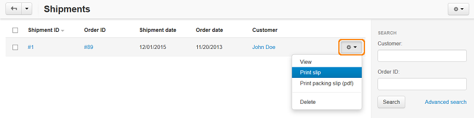
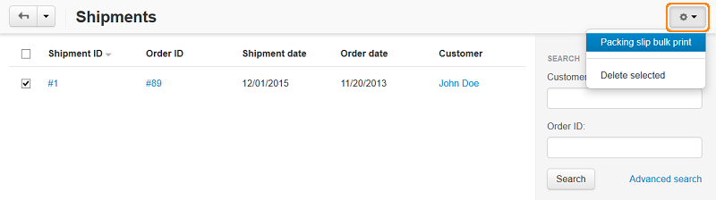

***************************
How To: Print Package Slips
***************************

To print a package slip for a particular shipment:

*	In the Administration panel, go to **Orders > Shipments**.

You will see a list of all shipments in the store. If necessary, filter the list of displayed orders using the search panel above the list.

*	Select a shipment for which you need to print a package slip and click the gear button.

*	Choose **Print slip** from the drop-down list, if you want a package slip to be displayed in a separate window for further printing. And choose **Print packing slip (pdf)**, if you want to download a slip in the .pdf format.

To print several package slips for multiple shipments at a time:

*	In the **Orders > Shipments** section select shipments for which you need to print package slips.
*	Click the gear button in the upper right corner of the page and choose **Packing slip bulk print**.

