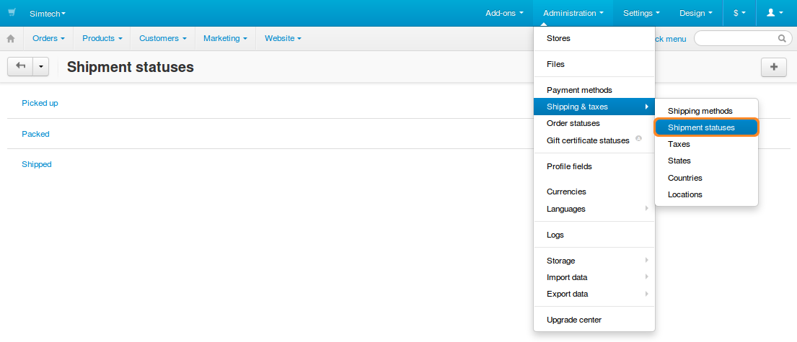
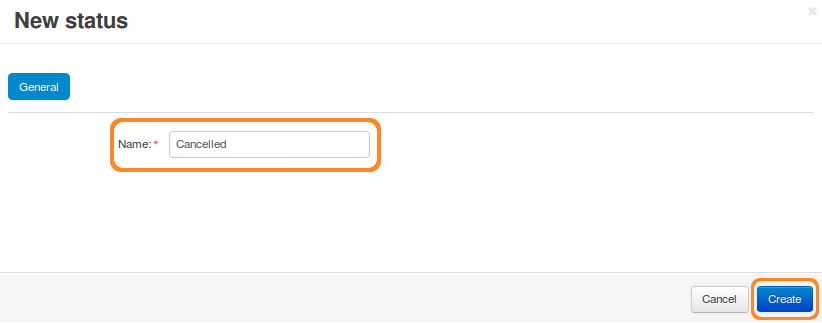

********************************
How To: Manage Shipment Statuses
********************************

.. note::

    **Tutorial Difficulty: 1 / 3**
    
    This functionality was not available before CS-Cart & Multi-Vendor 4.3.7.

If you go to **Orders → Shipments**, you will see all the list of all shipments in your store. Shipments have statuses, allowing you to sort the list, or to search for shipments with a specific status.

By default, there are 3 statuses: *Packed*, *Picked up*, and *Shipped*. However, you can edit them, or add your own statuses.

.. note::

    Shipment statuses do not affect anything—they only help you manage your list of shipments.

.. image:: img/shipment_statuses.png
    :align: center
    :alt: Since version 4.3.7 a shipment can have a status.

============================
Add Your Own Shipment Status
============================

1. Go to **Administration → Shipping & taxes → Shipment statuses**.

2. Click the **+** button in the top right corner, and choose **Add status**.

3. Name your status and click **Create**. After that you should be able to select your status on the shipment list.

========================
Delete a Shipment Status
========================

1. Go to **Administration → Shipping & taxes → Shipment statuses**.

2. Click the **gear** button of the shipment status.

3. Choose **Delete**.

.. hint::

    You can also use the **Edit** action to change the name of the status.

.. image:: img/delete_shipment_status.png
    :align: center
    :alt: Use the gear button of the status to edit or delete it.
