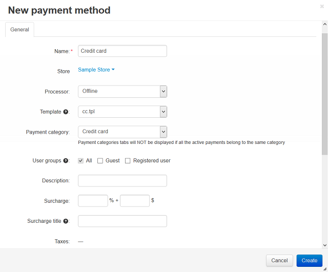

****************************
How To: Add a Payment Method
****************************

To add a payment method:

*	In the Administration panel, go to **Administration → Payment Methods**.
	A list of the available payment methods is displayed.
*	Click the **+** button.
	This opens a form for creating a payment method.
	

*	Complete the form. See details :doc:`here <../payment_methods/configure_payment>`.
*	Click the **Create** button below the form.