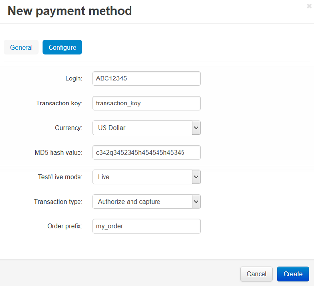

****************************************
How To: Set up CS-Cart with AuthorizeNet
****************************************

*   In the Administration panel, go to **Administration → Payment methods**.
*   Click the **+** button on the right.
*   In the opened window:

    *   In the **Name** field type *AuthorizeNet*.
    *   In the **Processor** select box select *AuthorizeNet.Aim*.
    *   If necessary, specify other fields and upload an icon.

*   Open the **Configure** tab in the same window to view the AuthorizeNet settings.

*   Fill in the following fields:

    *   **Login** — your AuthorizeNet login.
    *   **Transaction key** — transaction key that you can get on the AuthorizeNet web site.
    *   **Currency** — the currency in your AuthorizeNet account. If it does not match the base currency in your CS-Cart settings, please contact CS-Cart support team.
    *   **MD5 hash value** — MD5 hash value that you can get on the AuthorizeNet web site.
    *   **Test/Live mode** — set it to *Test* while testing the credit card processing through this payment gateway.
    *   **Transaction type** — select a transaction type. If you use the *Authorize only* type, AuthorizeNet.Aim only checks your credit card data and does not make any payments. If you use the *Authorize and capture* type, AuthorizeNet.Aim checks all information and makes a payment. So, for real payments you should use the second type of transaction.
    *   **Order prefix** — any prefix you want invoice IDs to have on AuthorizeNet site (optional field) (for instance, *mycart*). Using the prefix allows to prevent duplicate invoice IDs in case you use the same AuthorizeNet account for accepting payment from several websites.

*   Click the **Create** button to save the changes.

.. important::

	In order to use AuthorizeNet as a payment method on your site, there must be PHP's Curl support on your server. You are able to read more about it `here <http://www.php.net/curl>`_.